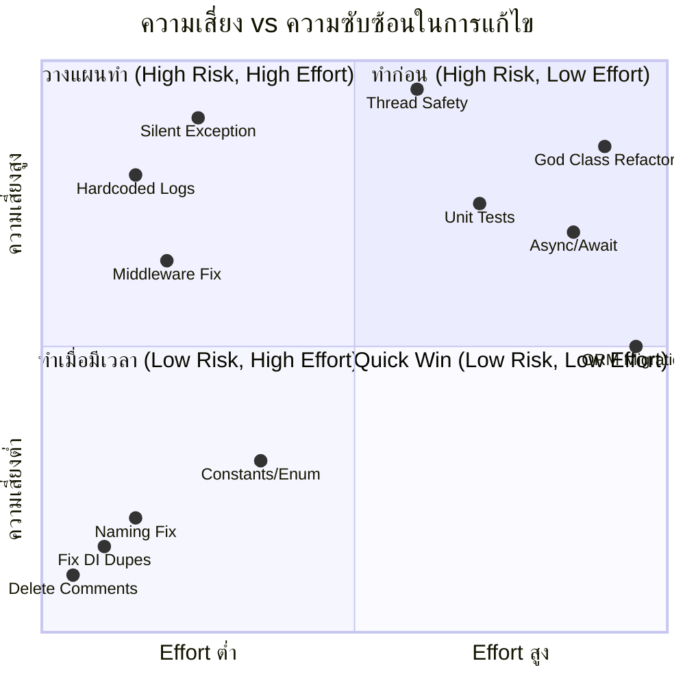

# 📋 สรุปปัญหาระบบ OIC IIQE

**ระบบ:** OIC IIQE (Insurance Intermediary Qualification Examination)  
**เทคโนโลยี:** .NET Core MVC + Oracle Database  
**วันที่วิเคราะห์:** 8 มีนาคม 2569  

---

## 1. ภาพรวมระบบ

ระบบ OIC IIQE เป็นระบบจัดการการสอบตัวแทน/นายหน้าประกันภัย ประกอบด้วย:

| โปรเจกต์ | ประเภท | หน้าที่ |
|---|---|---|
| **OIC_IIQE** | MVC Web App | เว็บหลักสำหรับผู้ใช้งาน (120 Controllers, 280 Views) |
| **IIQE_API** | Web API | REST API สำหรับระบบภายนอก (29 Controllers) |
| **IIQE_BL** | Business Logic | ชั้น Logic (~83 BL classes) |
| **IIQE_DL** | Data Layer | ชั้น Data Access (~100+ Repository) |
| **IIQE_MODELS** | Models | DTO / ViewModel (~300 files) |
| **IIQE_UTILITY** | Utility | Helper / Log (8 files) |
| **Batch Processes** | Console Apps | 3 โปรเจกต์สำหรับ background jobs |

---

## 2. สรุปปัญหาจำแนกตามระดับความรุนแรง

### 🔴 วิกฤต (Critical) — 4 ปัญหา

| # | ปัญหา | จำนวนที่พบ | ผลกระทบ |
|---|---|---|---|
| C1 | **Silent Exception Swallowing** — catch exception แล้วไม่ log ไม่ throw | 140+ จุด | Debug ไม่ได้เมื่อเกิด error, data สูญหายเงียบๆ |
| C2 | **Thread Safety ใน Repository** — ใช้ shared field `DataTable dt`, `string SQL` | 100+ Repository | Data corruption เมื่อ concurrent requests |
| C3 | **Hardcoded Log Path** — log path เขียนตายที่ `C:\LogFile\` | Utility layer | Log fail บน production ที่ path ต่างกัน |
| C4 | **ไม่มี Unit Test** — ไม่มี test project เลยทั้งระบบ | ทั้งระบบ | ไม่สามารถตรวจจับ regression ได้ |

### 🟠 สำคัญ (High) — 4 ปัญหา

| # | ปัญหา | จำนวนที่พบ | ผลกระทบ |
|---|---|---|---|
| H1 | **God Classes** — ไฟล์ BL/Repo ที่ใหญ่เกินไป (สูงสุด 11,858 บรรทัด) | 6+ ไฟล์วิกฤต | Maintain ยาก, bug-prone, deploy ช้า |
| H2 | **Code Duplication** — utility methods ถูก copy-paste ทุก layer | ทั่วโปรเจกต์ | แก้ bug ต้องแก้หลายที่, inconsistency |
| H3 | **Deprecated API** — ใช้ `IHostingEnvironment` ที่ deprecated | 15+ ไฟล์ | อาจถูกลบใน .NET version ถัดไป |
| H4 | **No Async/Await** — DB, HTTP, File I/O เป็น synchronous ทั้งหมด | ทั้งระบบ | Thread starvation ภายใต้ high load |

### 🟡 ปานกลาง (Medium) — 6 ปัญหา

| # | ปัญหา | จำนวนที่พบ | ผลกระทบ |
|---|---|---|---|
| M1 | **Middleware Misconfiguration** — middleware ซ้ำ + register หลัง UseEndpoints | API Startup | Security bypass, middleware ไม่ทำงาน |
| M2 | **Constructor Over-injection** — constructor รับ 9+ dependencies | หลายไฟล์ | SRP violation, test ยาก |
| M3 | **DI Registration ซ้ำ** — registered service ซ้ำใน Binder | Binder.cs | สิ้นเปลืองทรัพยากร |
| M4 | **Magic Numbers/Strings** — status codes, role ids เขียนตรงใน code | ทั่วโปรเจกต์ | อ่านยาก, เข้าใจยาก, แก้ไขผิดพลาดง่าย |
| M5 | **Configuration ไม่เป็น Pattern** — อ่าน config ทีละตัวใน constructor | BL layer | ไม่มี validation, ยากต่อการ manage |
| M6 | **Naming Convention ไม่สม่ำเสมอ** — ชื่อสะกดผิด, format ไม่เหมือนกัน | 5+ ไฟล์ | สับสน, search หา code ยาก |

### 🟢 ควรปรับปรุง (Low) — 5 ปัญหา

| # | ปัญหา | ผลกระทบ |
|---|---|---|
| L1 | **ไม่มี Global Error Handling** | แต่ละ controller จัดการ error ไม่เหมือนกัน |
| L2 | **Commented-out Code ทิ้งไว้ทั่ว** | อ่านยาก, confusing |
| L3 | **UseHttpsRedirection ซ้ำ 2 ครั้ง** | ไม่มีผลร้ายแต่สะท้อนถึง code review ที่ขาด |
| L4 | **DataTable เป็น Return Type ระหว่าง Layer** | Tight coupling ระหว่าง DL กับ BL |
| L5 | **API Response Format ไม่มาตรฐาน** | Client integrate ยาก |

---

## 3. ไฟล์ที่พบปัญหาสูงสุด (Top 10)

| # | ไฟล์ | ขนาด | ปัญหาหลัก |
|---|---|---|---|
| 1 | `IIQE_CorpExamRequestRepo.cs` (DL) | 641 KB / ~11,858 lines | God Class, Thread Safety, Raw SQL |
| 2 | `IIQE_CorpExamRequestBL.cs` (BL) | 440 KB / ~9,516 lines | God Class, Silent Catch, Constructor Over-injection |
| 3 | `IIQE_UserBL.cs` (BL) | 344 KB | God Class, Silent Catch |
| 4 | `IIQE_RegisterBL.cs` (BL) | 300 KB | God Class, Code Duplication |
| 5 | `IIQE_GroupExamRequestBL.cs` (BL) | 298 KB | God Class, Silent Catch |
| 6 | `IIQE_RegisterPersonalMemberBL.cs` (BL) | 223 KB | God Class, Deprecated API |
| 7 | `IIQE_PersonalExamRoundBL.cs` (BL) | 200 KB | God Class |
| 8 | `IIQE_ReceiptBL.cs` (BL) | 181 KB | God Class |
| 9 | `CorpExamRequestController.cs` (Web) | 102 KB / ~2,410 lines | Fat Controller, Code Duplication |
| 10 | `GroupExamRequestController.cs` (Web) | 97 KB | Fat Controller, Code Duplication |

---

## 4. Risk Assessment

---

## 5. ดูรายละเอียดเพิ่มเติม

| เอกสาร | เนื้อหา |
|---|---|
| [02_source_code_analysis.md](file:///C:/Users/Pachara/.gemini/antigravity/brain/090b5173-6ce8-4f8c-b0b2-7ad627a8c771/02_source_code_analysis.md) | วิเคราะห์ Source Code โดยละเอียด |
| [03_roadmap.md](file:///C:/Users/Pachara/.gemini/antigravity/brain/090b5173-6ce8-4f8c-b0b2-7ad627a8c771/03_roadmap.md) | Roadmap การแก้ไข ระยะสั้น / กลาง / ยาว |
| [04_phase1_quick_wins.md](file:///C:/Users/Pachara/.gemini/antigravity/brain/090b5173-6ce8-4f8c-b0b2-7ad627a8c771/04_phase1_quick_wins.md) | คู่มือ Phase 1: Quick Wins |
| [05_phase2_data_type_transaction.md](file:///C:/Users/Pachara/.gemini/antigravity/brain/090b5173-6ce8-4f8c-b0b2-7ad627a8c771/05_phase2_data_type_transaction.md) | คู่มือ Phase 2: Data Type & Transaction |
| [06_phase3_refactor_god_class.md](file:///C:/Users/Pachara/.gemini/antigravity/brain/090b5173-6ce8-4f8c-b0b2-7ad627a8c771/06_phase3_refactor_god_class.md) | คู่มือ Phase 3: Refactor God Class |
| [07_phase4_infrastructure.md](file:///C:/Users/Pachara/.gemini/antigravity/brain/090b5173-6ce8-4f8c-b0b2-7ad627a8c771/07_phase4_infrastructure.md) | คู่มือ Phase 4: Infrastructure & Testing |
