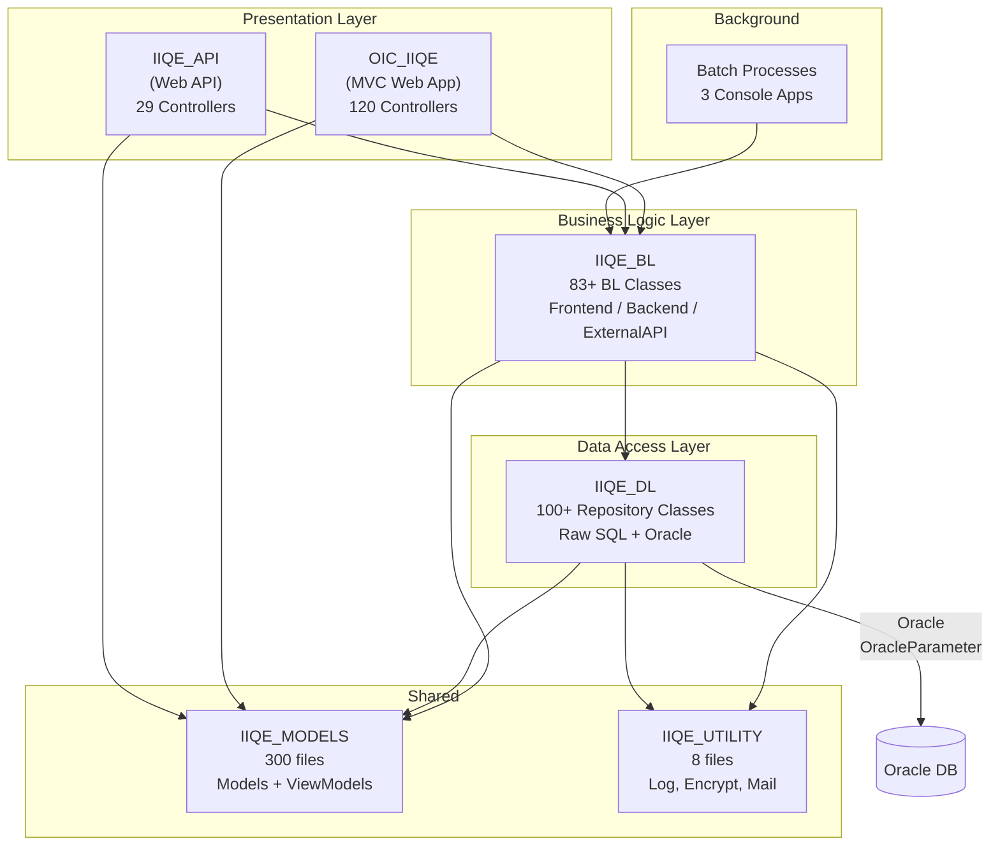

# 🔬 วิเคราะห์ Source Code ระบบ OIC IIQE

**ระบบ:** OIC IIQE (.NET Core MVC)  
**วันที่วิเคราะห์:** 8 มีนาคม 2569  

---

## 1. โครงสร้างระบบ (Architecture Overview)



---

## 2. วิเคราะห์ชั้น Presentation — OIC_IIQE (MVC Web App)

### 2.1 Startup.cs — ปัญหาที่พบ

**UseHttpsRedirection ถูกเรียกซ้ำ 2 ครั้ง:**
```csharp
// OIC_IIQE/Startup.cs
app.UseHttpsRedirection();   // ← บรรทัดที่ 131
app.UseStaticFiles();
app.UseSession();
app.UseRouting();
app.UseHttpsRedirection();   // ← บรรทัดที่ 137 ซ้ำ!
```

**Commented-out localization code ทิ้งไว้ ~25 บรรทัด:**
```csharp
//services.Configure<RequestLocalizationOptions>(options =>
//{
//    var supportedCultures = new[]
//    {
//        new CultureInfo("th"),
//        new CultureInfo("en")
//    };
//    ... (25 lines commented)
//});
```

**Route definitions ชื่อซ้ำกัน:**
```csharp
// ชื่อ route ซ้ำ — route หลังจะ override route แรก
endpoints.MapControllerRoute(
    name: "ManageSupervisorSpecialAttendee", ...);  // ← ชื่อซ้ำ
endpoints.MapControllerRoute(
    name: "ManageSupervisorSpecialAttendee", ...);  // ← ชื่อซ้ำ

endpoints.MapControllerRoute(
    name: "ReportExaminationRate", ...);  // ← ชื่อซ้ำ
endpoints.MapControllerRoute(
    name: "ReportExaminationRate", ...);  // ← ชื่อซ้ำ
```

### 2.2 Controllers — Fat Controllers

**CorpExamRequestController.cs (102 KB, ~2,410 lines):**

```csharp
public class CorpExamRequestController : Controller
{
    // ❌ ทุก action method มีรูปแบบ if-else เดียวกันซ้ำทั้งไฟล์
    public JsonResult SearchResult(CorpExamRequestSearch search)
    {
        // ... boilerplate code ...
        if (IsExternal && (search.role_type_id == 1 || search.role_type_id == 2))
            result = _service.SearchResult(search);
        else
            result = _ICorpExamRequestBL.SearchResult(search);
        return Json(result);
    }

    // ❌ Pattern เดิมซ้ำอีก 50+ ครั้งในไฟล์เดียว
    public JsonResult SearchHistory(CorpExamRequestSearch search)
    {
        // ... boilerplate code เดิม ...
        if (IsExternal && (search.role_type_id == 1 || search.role_type_id == 2))
            result = _service.SearchHistory(search);
        else
            result = _ICorpExamRequestBL.SearchHistory(search);
        return Json(result);
    }
}
```

**ปัญหา:**
- `ConvertToInt64()` ถูกเขียนซ้ำในตัว Controller (ควรอยู่ใน shared utility)
- Session access (`HttpContext.Session.GetString(...)`) ซ้ำทุก method
- Culture detection (`Request.HttpContext.Features.Get<IRequestCultureFeature>()`) ซ้ำทุก method
- `if (IsExternal)` pattern ซ้ำทุก method — ควรใช้ Strategy Pattern

---

## 3. วิเคราะห์ชั้น API — IIQE_API

### 3.1 Startup.cs — Middleware Pipeline ที่มีปัญหา

```csharp
// ❌ ปัญหา 1: Middleware ซ้ำซ้อน
app.UseWhen(ctx => ctx.Request.Path.StartsWithSegments("/api/Receipt"), 
    _appBuilder => { _appBuilder.UseMiddleware<AuthReceiptMiddleware>(); });
app.UseWhen(ctx => !ctx.Request.Path.StartsWithSegments("/api/Receipt"), 
    _appBuilder => { _appBuilder.UseMiddleware<ApiKeyMiddleware>(); });

// ↓ ซ้ำอีกครั้ง! (ด้วย sub-path)
app.UseWhen(ctx => ctx.Request.Path.StartsWithSegments("/api/Receipt/C_Receipt"), 
    _appBuilder => { _appBuilder.UseMiddleware<AuthReceiptMiddleware>(); });
app.UseWhen(ctx => !ctx.Request.Path.StartsWithSegments("/api/Receipt/C_Receipt"), 
    _appBuilder => { _appBuilder.UseMiddleware<ApiKeyMiddleware>(); });

// ❌ ปัญหา 2: Middleware register หลัง UseEndpoints
app.UseEndpoints(endpoints => { endpoints.MapControllers(); });

// ↓ middleware นี้จะไม่ถูก execute เพราะอยู่หลัง UseEndpoints
app.UseWhen(ctx => ctx.Request.Path.StartsWithSegments("/api/AgentRound"), 
    _appBuilder => { _appBuilder.UseMiddleware<AuthMiddleware>(); });
```

### 3.2 API Controller ขนาดใหญ่

| Controller | ขนาด | หมายเหตุ |
|---|---|---|
| `CorpExamRequestController.cs` | 50 KB | API สำหรับ Corp Exam |
| `GroupExamRequestController.cs` | 47 KB | API สำหรับ Group Exam |
| `ExamLocationSpecialController.cs` | 20 KB | API สำหรับ Special Location |
| `ExamRequestController.cs` | 20 KB | API สำหรับ Exam Request |

### 3.3 API Authentication — Header-based API Key

```csharp
// ApiKeyMiddleware.cs — ใช้ single API key ตรวจสอบ
private const string APIKEY = "IIQE-Key";
// ✔ ใช้ parameterized comparison
// ❌ ไม่มี rate limiting
// ❌ ไม่มี request logging
// ❌ API key เดียวสำหรับทุก client
```

---

## 4. วิเคราะห์ชั้น Business Logic — IIQE_BL

### 4.1 Constructor Over-injection (ตัวอย่างที่แย่ที่สุด)

```csharp
// IIQE_CorpExamRequestBL.cs — Constructor รับ 9 dependencies
// แล้วอ่าน configuration ถึง 60+ ค่า
public IIQE_CorpExamRequestBL(
    IIQE_ICorpExamRequestRepo corpExamRequestRepo,
    IConfiguration configuration,
    IIQE_IBillPaymentBL billBL,
    IIQE_ISendEmailBL sentmail,
    IIQE_IReceiptBL _IReceiptBL,
    IIQE_IExamRequestBL examRequest,
    IIQE_IBillPaymentRepo billRepo,
    IHostingEnvironment environment,   // ❌ deprecated
    IIQE_ILogsRepo logsRepo)
{
    // 130+ lines of configuration reading in constructor
    _PathEmail = configuration.GetSection("OIC_API_SENDMAIL")["URL"];
    _Sendemail_oic_sys_id = configuration.GetSection("OIC_API_SENDMAIL")["oic-sys-id"];
    // ... อีก 57 ค่า
}
```

**Class นี้มี private fields ถึง 60+ ตัว** ที่เก็บ configuration values

### 4.2 Silent Exception Pattern (วิกฤต)

**ตัวอย่างจาก IIQE_ComfirmationExamRequestBL.cs** — พบ 30+ จุดในไฟล์เดียว:

```csharp
// ❌ Pattern ซ้ำ 30+ ครั้ง: catch แล้วไม่ทำอะไร
public DataTable GetSomeData(int id)
{
    DataTable dt = new DataTable();
    try
    {
        dt = ConvertToList<SomeModel>(_repo.GetData(id));
    }
    catch (Exception ex) { }   // ← exception หายไม่มีร่องรอย
    return dt;
}
```

```csharp
// ❌ ตัวอย่างที่อันตรายกว่า: data operation ที่ fail เงียบ
public void InsertExamAtchFromCorpMember(Int64 exam_req_id, ...)
{
    try
    {
        // ... file copy + database insert ...
        File.Copy(sourceFile, destFile, true);
        _ICorpExamRequestRepo.InsertMultifile(item);
    }
    catch
    {
        // ❌ file copy fail → ไม่มีใครรู้
        // ❌ database insert fail → ไม่มีใครรู้
    }
}
```

### 4.3 Business Logic ที่ไม่ควรอยู่ใน BL

```csharp
// ❌ BL ไม่ควร handle HTTP calls โดยตรง
// แต่ IIQE_CorpExamRequestBL.cs มี RestSharp calls ตรงๆ
private Int64 ChkReportSendStatus(Int64 corp_member_id)
{
    var client = new RestClient(fullUrl);
    client.Timeout = -1;
    var request = new RestRequest(Method.GET);
    request.AddHeader("Content-Type", "application/json");
    request.AddHeader("oic-sys-id", _OIC_SYS_ID);
    // ... direct HTTP call ใน BL layer
}
```

### 4.4 Reflection-based Mapping ที่ซ้ำกันทุก BL class

```csharp
// ❌ ConvertToList<T> ใช้ Reflection — ช้า, ซ้ำทุกไฟล์
public static List<T> ConvertToList<T>(DataTable dt)
{
    var columnNames = dt.Columns.Cast<DataColumn>()
        .Select(c => c.ColumnName.ToLower()).ToList();
    var properties = typeof(T).GetProperties();
    return dt.AsEnumerable().Select(row => {
        var objT = Activator.CreateInstance<T>();
        foreach (var pro in properties)
        {
            if (columnNames.Contains(pro.Name.ToLower()))
            {
                try { pro.SetValue(objT, row[pro.Name]); }
                catch (Exception ex) { }  // ← silent catch อีก!
            }
        }
        return objT;
    }).ToList();
}
```

---

## 5. วิเคราะห์ชั้น Data Layer — IIQE_DL

### 5.1 Thread Safety — ปัญหาร้ายแรง

```csharp
// ❌ ทุก Repository มีรูปแบบเดียวกันนี้
public class IIQE_CorpExamRequestRepo : IIQE_ICorpExamRequestRepo
{
    DataTable dt = new DataTable();           // ❌ shared instance field
    string SQL = "";                           // ❌ shared instance field
    ClassConnectDB conn = new ClassConnectDB(); // ❌ shared instance

    public DataTable GetData1()
    {
        SQL = "SELECT ...";  // ← overwrite shared field
        dt = conn.ExecuteReaderWithParams(SQL, ...);  // ← overwrite shared field
        return dt;
    }

    public DataTable GetData2()
    {
        SQL = "SELECT ...";  // ← ถ้า GetData1 กำลังทำงานอยู่ SQL จะถูก overwrite!
        dt = conn.ExecuteReaderWithParams(SQL, ...);
        return dt;
    }
}
```

**สถานการณ์ที่เกิดปัญหา:**
1. Request A เรียก `GetData1()`, set `SQL = "SELECT * FROM table1"`
2. ก่อน execute, Request B เรียก `GetData2()`, overwrite `SQL = "SELECT * FROM table2"`
3. Request A execute `SQL` — ได้ผลลัพธ์ของ table2 แทน table1!

### 5.2 ClassConnectDB — Database Access Pattern

```csharp
// ❌ ปัญหา 1: Log connection string (sensitive data) ทุกครั้ง
Logfile.Information(datasource);  // ← log connection string!
Logfile.Information(SQL);         // ← log SQL (อาจมี PII)

// ❌ ปัญหา 2: Error handling ที่ไม่สม่ำเสมอ
// ExecuteReaderWithParams → catch แล้ว return empty DataTable (เงียบ)
// ExecuteNonQueryWithTransaction → catch แล้ว rollback (ไม่ throw)
// ExecuteQueryWithTransaction → catch แล้ว throw (ดี)
// ExecuteNonQueryWithUpdate → catch แล้ว throw (ดี)

// ❌ ปัญหา 3: มี unimplemented methods
internal T ExecuteScalarWithParams<T>(string query, ...)
{
    throw new NotImplementedException();  // ← มีอยู่แต่ไม่ implement
}
```

### 5.3 Raw SQL String Building

```csharp
// ❌ SQL ที่สร้างแบบ string concatenation (ยาวมาก)
// ตัวอย่างจาก CorpExamRequestSearch — SQL เดียวยาว 100+ บรรทัด
SQL = @"SELECT exam.id AS exam_req_id, ...
        FROM iiqe_t_c_exam_req exam
        INNER JOIN mt_t_corp_member corp ON ...
        WHERE 1=1 ";

// ✔ อย่างน้อยใช้ OracleParameter (ป้องกัน SQL Injection)
if (search.corp_member_id != 0)
{
    SQL += " AND exam.corp_member_id = :CORP_MEMBER_ID ";
    oracleParameters[0] = new OracleParameter("CORP_MEMBER_ID", ...);
}
// ⚠ แต่ SQL string ยาวเกินไป ควรใช้ stored procedure หรือ ORM
```

### 5.4 Duplicate SQL — EN/TH Duplication

```csharp
// ❌ ทุก method ที่ support bilingual จะ duplicate SQL ทั้งก้อน
if (lng == "en")
{
    SQL = @"SELECT id AS Value, name_en AS Text 
            FROM mt_t_exam_location WHERE is_active = 1";
}
else
{
    SQL = @"SELECT id AS Value, name_th AS Text 
            FROM mt_t_exam_location WHERE is_active = 1";
}
// ✅ ควรเปลี่ยนเป็น:
// SQL = $"SELECT id AS Value, name_{lng} AS Text FROM ..."
// หรือใช้ CASE WHEN ใน SQL
```

---

## 6. วิเคราะห์ Utility Layer — IIQE_UTILITY

### 6.1 ClassLogfile.cs — ปัญหาร้ายแรง

```csharp
// ❌ ปัญหา 1: สร้าง Logger ใหม่ทุกครั้งที่ log
public static void Information(string msg)
{
    Log.Logger = new LoggerConfiguration()   // ← new config ทุกครั้ง
        .MinimumLevel.Debug()
        .WriteTo.File(@"C:\LogFile\Information\Information_Log_.txt", ...)
        .CreateLogger();
    Log.Information(msg);
    // ← ไม่มี Log.CloseAndFlush() → resource leak
}

// ❌ ปัญหา 2: Hardcoded path to C:\LogFile\
// ❌ ปัญหา 3: fileSizeLimitBytes: 100240 (เพียง ~100KB — เล็กมาก)
// ❌ ปัญหา 4: ทุก method ซ้ำกัน ต่างแค่ path
```

**จำนวน methods ที่ทำเหมือนกัน:** 11 methods (Information, Error, UserInformation, BillInformation, PayInInformation, BillInformation_C, PayInInformation_C, BillInformation_G, PayInInformation_G, RegisterPersonalInfo, CreateBillPayment_Customer, ElicensingLog)

---

## 7. วิเคราะห์ Models — IIQE_MODELS

| Folder | จำนวนไฟล์ | หมายเหตุ |
|---|---|---|
| `Models/` | 111 files | Entity/Domain models |
| `ViewModels/` | 189 files | Request/Response DTOs |

**ปัญหาที่พบ:**
- ไม่มี Data Annotations / validation attributes
- ViewModel ที่ใช้ร่วมกันหลาย context (อาจ over-expose fields)
- ไม่แยก Request DTO กับ Response DTO อย่างชัดเจน

---

## 8. วิเคราะห์ Dependency Injection — Binder.cs

```csharp
// IIQE_BL/Binder.cs — 150+ service registrations
// ❌ ปัญหา: มี duplicate registrations
services.AddScoped<IIQE_IExamCenterBL, IIQE_ExamCenterBL>();    // line 40
services.AddScoped<IIQE_IExamCenterBL, IIQE_ExamCenterBL>();    // line 46 (ซ้ำ!)

services.AddScoped<IIQE_ApproveExamResultLicenseBL>();           // line 121
services.AddScoped<IIQE_ApproveExamResultLicenseBL>();           // line 165 (ซ้ำ!)

services.AddScoped<IIQE_IYearlyHolidayFrontendBL, ...>();        // line 62
services.AddScoped<IIQE_IYearlyHolidayFrontendBL, ...>();        // line 176 (ซ้ำ!)

// ❌ ปัญหา: บาง service register แบบไม่ใช้ interface
services.AddScoped<IIQE_ExamFeeBL>();            // ← no interface
services.AddScoped<IIQE_ExamLocationGroupBL>();  // ← no interface
services.AddScoped<IIQE_AttachmentReqBL>();      // ← no interface
// ... (20+ services ไม่มี interface)
```

---

## 9. สรุปผลวิเคราะห์แยกตามชั้น

| ชั้น | คะแนนคุณภาพ | ปัญหาหลัก |
|---|---|---|
| **Presentation** (OIC_IIQE) | ⭐⭐☆☆☆ (2/5) | Fat controllers, code duplication, commented code |
| **API** (IIQE_API) | ⭐⭐☆☆☆ (2/5) | Middleware misconfiguration, no standard response |
| **Business Logic** (IIQE_BL) | ⭐☆☆☆☆ (1/5) | God classes, silent exceptions, no async, HTTP in BL |
| **Data Layer** (IIQE_DL) | ⭐☆☆☆☆ (1/5) | Thread safety, raw SQL, DataTable returns |
| **Utility** (IIQE_UTILITY) | ⭐☆☆☆☆ (1/5) | Hardcoded paths, logger recreation, code duplication |
| **Models** (IIQE_MODELS) | ⭐⭐⭐☆☆ (3/5) | No validation, no DTO separation |

> [!WARNING]
> คะแนนรวมการ maintain ได้ต่ำมาก (~1.7/5) — ต้องมีแผนปรับปรุงเร่งด่วนโดยเฉพาะชั้น BL และ DL
