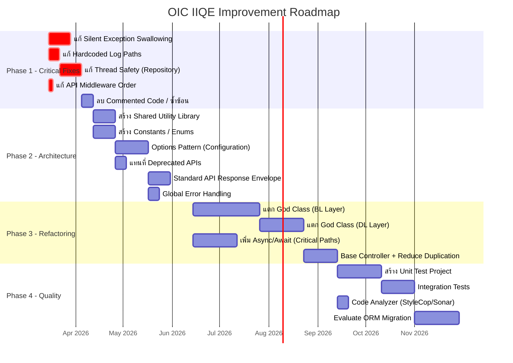
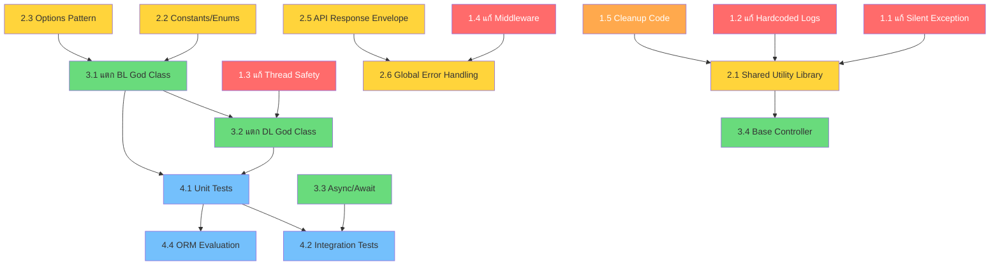

# 🗺️ Roadmap การแก้ไขปัญหาระบบ OIC IIQE

**ระบบ:** OIC IIQE (.NET Core MVC)  
**ระยะเวลารวม:** ~36 สัปดาห์ (9 เดือน)  
**วันที่จัดทำ:** 8 มีนาคม 2569  

---

## 1. ภาพรวม Roadmap

---

## 2. รายละเอียดแต่ละ Phase

### Phase 1: Critical Fixes (ระยะสั้น — สัปดาห์ที่ 1-4)

> **เป้าหมาย:** แก้ไขปัญหาที่ส่งผลต่อ stability และ debuggability ของระบบทันที

| # | งาน | Effort | ความเสี่ยง | Dependency |
|---|---|---|---|---|
| 1.1 | แก้ Silent Exception Swallowing (140+ จุด) | 🟡 Medium | 🔴 Critical | ไม่มี |
| 1.2 | แก้ Hardcoded Log Paths + Logger Singleton | 🟢 Low | 🔴 Critical | ไม่มี |
| 1.3 | แก้ Thread Safety ใน Repository (shared fields) | 🟠 High | 🔴 Critical | ไม่มี |
| 1.4 | แก้ API Middleware Order + ลบ duplicates | 🟢 Low | 🟡 Medium | ไม่มี |
| 1.5 | ลบ Commented Code, ลบ DI Duplicates, แก้ HTTPS ซ้ำ | 🟢 Low | 🟢 Low | ไม่มี |

**ผลลัพธ์ที่คาดหวัง:**
- ✅ ทุก exception ถูก log อย่างครบถ้วน
- ✅ Log file สามารถ configure path ได้ผ่าน appsettings.json
- ✅ ไม่มี data corruption จาก concurrent requests
- ✅ Middleware pipeline ทำงานถูกต้อง

---

### Phase 2: Architecture Improvements (ระยะกลาง — สัปดาห์ที่ 5-12)

> **เป้าหมาย:** ปรับโครงสร้างพื้นฐานให้พร้อมสำหรับการ refactor ขนาดใหญ่

| # | งาน | Effort | ความเสี่ยง | Dependency |
|---|---|---|---|---|
| 2.1 | สร้าง Shared Utility Library (ConvertToInt64, ConvertToList, etc.) | 🟡 Medium | 🟢 Low | Phase 1 done |
| 2.2 | สร้าง Constants / Enums (FlowStatus, RoleType, ErrorCode) | 🟡 Medium | 🟢 Low | ไม่มี |
| 2.3 | ใช้ IOptions&lt;T&gt; Pattern แทน configuration reads ตรง | 🟡 Medium | 🟡 Medium | ไม่มี |
| 2.4 | แทนที่ IHostingEnvironment → IWebHostEnvironment | 🟢 Low | 🟢 Low | ไม่มี |
| 2.5 | สร้าง Standard API Response Envelope | 🟡 Medium | 🟡 Medium | ไม่มี |
| 2.6 | สร้าง Global Exception Handling Middleware | 🟡 Medium | 🟢 Low | 2.5 |

**ผลลัพธ์ที่คาดหวัง:**
- ✅ ลด code duplication ในส่วน utility 80%+
- ✅ Magic numbers ถูกแทนที่ด้วย readable constants
- ✅ Configuration เป็น strongly-typed มี validation
- ✅ API response format สม่ำเสมอทุก endpoint

---

### Phase 3: Code Refactoring (ระยะกลาง-ยาว — สัปดาห์ที่ 13-24)

> **เป้าหมาย:** แตก God Classes และปรับปรุง code quality อย่างมีนัยสำคัญ

| # | งาน | Effort | ความเสี่ยง | Dependency |
|---|---|---|---|---|
| 3.1 | แตก God Class ใน BL Layer (เริ่มจาก CorpExamRequest) | 🔴 Very High | 🟠 High | Phase 2 done |
| 3.2 | แตก God Class ใน DL Layer (Repository) | 🔴 Very High | 🟠 High | 3.1 |
| 3.3 | เพิ่ม Async/Await ใน critical paths | 🟠 High | 🟡 Medium | ไม่มี |
| 3.4 | สร้าง Base Controller + ลด duplication | 🟡 Medium | 🟢 Low | 2.1 |

**ผลลัพธ์ที่คาดหวัง:**
- ✅ ไม่มีไฟล์ที่ใหญ่เกิน 1,000 บรรทัด
- ✅ แต่ละ class ทำหน้าที่เดียว (Single Responsibility)
- ✅ Critical API paths ทำงานแบบ async

---

### Phase 4: Quality & Testing (ระยะยาว — สัปดาห์ที่ 25-36)

> **เป้าหมาย:** สร้างโครงสร้าง testing และ code quality enforcement

| # | งาน | Effort | ความเสี่ยง | Dependency |
|---|---|---|---|---|
| 4.1 | สร้าง Unit Test Project + tests สำหรับ BL Layer | 🟠 High | 🟢 Low | Phase 3 done |
| 4.2 | สร้าง Integration Tests สำหรับ critical flows | 🟠 High | 🟡 Medium | 4.1 |
| 4.3 | เพิ่ม Code Analyzer (StyleCop / SonarAnalyzer) | 🟢 Low | 🟢 Low | ไม่มี |
| 4.4 | Evaluate + Plan ORM Migration (Dapper / EF Core) | 🔴 Very High | 🟡 Medium | Phase 3 done |

**ผลลัพธ์ที่คาดหวัง:**
- ✅ Code coverage ≥ 40% สำหรับ BL Layer
- ✅ Critical business flows มี integration tests ครอบคลุม
- ✅ Coding standard บังคับใช้อัตโนมัติผ่าน CI/CD

---

## 3. Dependency Diagram

---

## 4. KPIs วัดผลความสำเร็จ

| Phase | KPI | เป้าหมาย | วิธีวัด |
|---|---|---|---|
| **Phase 1** | Empty catch blocks | 0 จุด | `grep "catch.*\{\s*\}"` |
| **Phase 1** | Hardcoded file paths | 0 จุด | Code review |
| **Phase 1** | Thread-unsafe shared fields | 0 จุด | Code review |
| **Phase 2** | Duplicate utility methods | ลดลง ≥80% | Line count comparison |
| **Phase 2** | Magic numbers remaining | ลดลง ≥90% | Code analysis |
| **Phase 3** | Max file line count | ≤ 1,000 lines | `wc -l` |
| **Phase 3** | Async coverage (API) | ≥ 50% endpoints | Code review |
| **Phase 4** | Unit test coverage (BL) | ≥ 40% | Coverage report |
| **Phase 4** | Build warnings | 0 warnings | CI/CD report |

---

## 5. Risk Mitigation Plan

| ความเสี่ยง | โอกาส | ผลกระทบ | แผนรับมือ |
|---|---|---|---|
| Refactor God Class ทำให้ระบบพัง | สูง | สูง | เขียน integration test ก่อน refactor, ทำทีละ method group |
| Thread Safety fix เปลี่ยน behavior | ปานกลาง | สูง | Test บน staging ก่อน deploy production |
| ทีมไม่คุ้นกับ async/await | ปานกลาง | ปานกลาง | จัดอบรม + เริ่มจาก non-critical paths ก่อน |
| Timeline ไม่ทัน | สูง | ปานกลาง | Phase 1-2 เป็น mandatory, Phase 3-4 ยืดหยุ่นได้ |

---

## 6. ลิงก์คู่มือแก้ไขแต่ละ Phase

| เอกสาร | เนื้อหา |
|---|---|
| [04_phase1_critical_fixes.md](file:///C:/Users/Pachara/.gemini/antigravity/brain/090b5173-6ce8-4f8c-b0b2-7ad627a8c771/04_phase1_critical_fixes.md) | คู่มือ Phase 1: Critical Fixes — step-by-step |
| [05_phase2_architecture_improvements.md](file:///C:/Users/Pachara/.gemini/antigravity/brain/090b5173-6ce8-4f8c-b0b2-7ad627a8c771/05_phase2_architecture_improvements.md) | คู่มือ Phase 2: Architecture Improvements |
| [06_phase3_code_refactoring.md](file:///C:/Users/Pachara/.gemini/antigravity/brain/090b5173-6ce8-4f8c-b0b2-7ad627a8c771/06_phase3_code_refactoring.md) | คู่มือ Phase 3: Code Refactoring |
| [07_phase4_quality_testing.md](file:///C:/Users/Pachara/.gemini/antigravity/brain/090b5173-6ce8-4f8c-b0b2-7ad627a8c771/07_phase4_quality_testing.md) | คู่มือ Phase 4: Quality & Testing |
