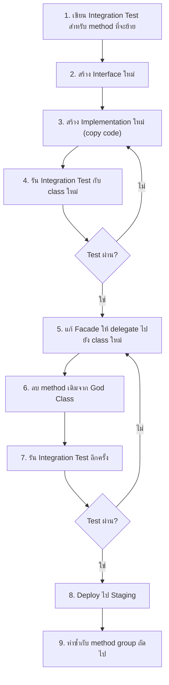

# ♻️ คู่มือแก้ไข Phase 3: Code Refactoring

**ระยะเวลา:** สัปดาห์ที่ 13-24  
**เป้าหมาย:** แตก God Classes, เพิ่ม Async, ลด Controller duplication  
**Prerequisite:** Phase 2 เสร็จสมบูรณ์

> [!CAUTION]
> Phase นี้เป็น Phase ที่มีความเสี่ยงสูงที่สุด เพราะเปลี่ยนโครงสร้าง code ที่มีอยู่ **ต้องทำ integration test ก่อนแตก class** เพื่อป้องกัน regression

---

## Task 3.1: แตก God Class — BL Layer

### เป้าหมาย
ลดขนาดไฟล์ที่มากกว่า 5,000 บรรทัด ให้เหลือไม่เกิน 1,000 บรรทัดต่อ class

### ลำดับความสำคัญ (เริ่มจากใหญ่สุด)

| # | ไฟล์ | บรรทัด | เป้าหมายแตกเป็น |
|---|---|---|---|
| 1 | `IIQE_CorpExamRequestBL.cs` | ~9,516 | 6-8 classes |
| 2 | `IIQE_RegisterBL.cs` | ~ใหญ่มาก | 4-5 classes |
| 3 | `IIQE_GroupExamRequestBL.cs` | ~ใหญ่มาก | 5-6 classes |
| 4 | `IIQE_UserBL.cs` | ~ใหญ่มาก | 3-4 classes |
| 5 | `IIQE_RegisterPersonalMemberBL.cs` | ~ใหญ่มาก | 3-4 classes |
| 6 | `IIQE_PersonalExamRoundBL.cs` | ~ใหญ่มาก | 3-4 classes |

### ตัวอย่าง: แตก IIQE_CorpExamRequestBL

**ขั้นตอนที่ 1: วิเคราะห์ Method Groups**

ดูจาก `#region` tags และ method naming patterns ในไฟล์:

```
IIQE_CorpExamRequestBL.cs (~9,516 lines)
├── Service (ConvertToInt64, CheckCurrentCulture, etc.) → Utility
├── Search (SearchResult, SearchHistory, etc.) → CorpExamSearchBL
├── Master Data (GetMasterSearch, GetMasterList) → CorpExamMasterBL
├── CRUD (InsertExamReq, DeleteExamRequest, Update) → CorpExamRequestCrudBL
├── Exam Round (AddExamRound, GetRound, ManageRound) → CorpExamRoundBL
├── Attendee (AddAttendee, RemoveAttendee, Validate) → CorpExamAttendeeBL
├── Approval (Submit, Approve, Reject, Recall) → CorpExamApprovalBL
├── Bill Payment (CreateBill, GenQR, GetToken) → CorpExamPaymentBL
├── Receipt (GenerateReceipt, PrintReceipt) → CorpExamReceiptBL
├── Report (ExportExcel, GenerateReport) → CorpExamReportBL
├── File (Upload, Download, Copy) → CorpExamFileBL
└── Broker/External API calls → CorpExamExternalApiBL
```

**ขั้นตอนที่ 2: สร้าง Interface ใหม่สำหรับแต่ละ group**

```csharp
// IIQE_BL/Managers/Frontend/Interfaces/CorpExam/ICorpExamSearchBL.cs
namespace IIQE_BL.Managers.Frontend.Interfaces.CorpExam
{
    public interface ICorpExamSearchBL
    {
        MasterList GetMasterSearch(MasterParam param);
        int ChkDefaultSearchFilter();
        List<CorpExamRequestList> SearchResultPagination(
            CorpExamRequestSearch search, Pagination item);
        List<CorpExamRequestList> SearchResult(CorpExamRequestSearch search);
        List<CorpExamRequestList> SearchOICResultPagination(
            CorpExamRequestSearch search, Pagination item);
        List<CorpExamRequestList> SearchHistory(CorpExamRequestSearch search);
        List<CorpExamRequestList> getSearchHistoryPagination(
            CorpExamRequestSearch search, Pagination item);
    }
}
```

```csharp
// IIQE_BL/Managers/Frontend/Interfaces/CorpExam/ICorpExamApprovalBL.cs
namespace IIQE_BL.Managers.Frontend.Interfaces.CorpExam
{
    public interface ICorpExamApprovalBL
    {
        ResponseModel SubmitExamRequest(string lng, ExamReqSaveData data);
        ResponseModel ApproveExamRequest(string lng, ExamReqSaveData data);
        ResponseModel RejectExamRequest(string lng, ExamReqSaveData data);
        ResponseModel ConfirmRecall(MasterParam param);
        // ... approval-related methods
    }
}
```

**ขั้นตอนที่ 3: สร้าง Implementation class ใหม่**

```csharp
// IIQE_BL/Managers/Frontend/Implementations/CorpExam/CorpExamSearchBL.cs
using IIQE_UTILITY.Extensions;

namespace IIQE_BL.Managers.Frontend.Implementations.CorpExam
{
    public class CorpExamSearchBL : ICorpExamSearchBL
    {
        private readonly IIQE_ICorpExamRequestRepo _repo;

        public CorpExamSearchBL(IIQE_ICorpExamRequestRepo repo)
        {
            _repo = repo;
        }

        public MasterList GetMasterSearch(MasterParam param)
        {
            // ← ย้าย code จาก IIQE_CorpExamRequestBL.GetMasterSearch มาที่นี่
            MasterList masterList = new MasterList();
            masterList.LicenseType = _repo.GetMasterLicenseType(param.lng, param.user_id)
                .ToList<MasterModel>();
            // ...
            return masterList;
        }

        public List<CorpExamRequestList> SearchResultPagination(
            CorpExamRequestSearch search, Pagination item)
        {
            // ← ย้าย code จาก IIQE_CorpExamRequestBL.SearchResultPagination มาที่นี่
        }
    }
}
```

**ขั้นตอนที่ 4: สร้าง Facade class (ชั่วคราว) ให้ backward compatible**

```csharp
// IIQE_BL/Managers/Frontend/Implementations/IIQE_CorpExamRequestBL.cs
// แก้ไขให้เป็น Facade ที่ delegate ไปยัง class ย่อย
public class IIQE_CorpExamRequestBL : IIQE_ICorpExamRequestBL
{
    private readonly ICorpExamSearchBL _search;
    private readonly ICorpExamApprovalBL _approval;
    private readonly ICorpExamPaymentBL _payment;
    // ...

    public IIQE_CorpExamRequestBL(
        ICorpExamSearchBL search,
        ICorpExamApprovalBL approval,
        ICorpExamPaymentBL payment,
        // ...)
    {
        _search = search;
        _approval = approval;
        _payment = payment;
    }

    // delegate ไปยัง sub-classes
    public MasterList GetMasterSearch(MasterParam param) 
        => _search.GetMasterSearch(param);
    
    public List<CorpExamRequestList> SearchResultPagination(
        CorpExamRequestSearch search, Pagination item)
        => _search.SearchResultPagination(search, item);
    
    public ResponseModel ConfirmRecall(MasterParam param) 
        => _approval.ConfirmRecall(param);

    // ... delegate ทุก method ที่มีอยู่
}
```

**ขั้นตอนที่ 5: ลงทะเบียน DI**

```csharp
// IIQE_BL/Binder.cs — เพิ่ม
services.AddScoped<ICorpExamSearchBL, CorpExamSearchBL>();
services.AddScoped<ICorpExamApprovalBL, CorpExamApprovalBL>();
services.AddScoped<ICorpExamPaymentBL, CorpExamPaymentBL>();
// ...
// IIQE_ICorpExamRequestBL ยังคงอยู่ — เป็น Facade
```

### Safe Refactoring Methodology



> [!IMPORTANT]
> **ทำทีละ method group** — อย่าย้ายทั้งหมดพร้อมกัน ทำ Search ก่อน → test → deploy → ทำ Approval → test → deploy

---

## Task 3.2: แตก God Class — DL Layer (Repository)

### หลักการเดียวกับ BL แต่แตกตาม domain

```
IIQE_CorpExamRequestRepo.cs (~11,858 lines)
├── Master Data → CorpExamMasterRepo
├── Search/List → CorpExamSearchRepo
├── CRUD (Insert/Update/Delete) → CorpExamCrudRepo
├── Round management → CorpExamRoundRepo
├── Attendee management → CorpExamAttendeeRepo
├── Attachment management → CorpExamAttachmentRepo
├── Approval flow → CorpExamApprovalRepo
└── Reporting queries → CorpExamReportRepo
```

> [!TIP]
> DL layer สามารถใช้วิธี **Partial Class** เป็น intermediate step ก่อนแยกเป็น class ต่างหาก  
> `partial class IIQE_CorpExamRequestRepo` → แยก file ตาม domain แต่ยังเป็น class เดียวกัน

```csharp
// ขั้นตอน intermediate: ใช้ partial class แยก file
// IIQE_DL/Repositories/Frontend/Implementations/CorpExamRequest/
//   IIQE_CorpExamRequestRepo.Master.cs
//   IIQE_CorpExamRequestRepo.Search.cs
//   IIQE_CorpExamRequestRepo.Crud.cs
//   IIQE_CorpExamRequestRepo.Approval.cs

// ไฟล์ IIQE_CorpExamRequestRepo.Search.cs:
namespace IIQE_DL.Repositories.Frontend.Implementations
{
    public partial class IIQE_CorpExamRequestRepo
    {
        public DataTable CorpExamRequestSearch(CorpExamRequestSearch search)
        {
            // ย้าย code มาจากไฟล์หลัก
        }

        public DataTable CorpExamRequestSearchPagination(
            CorpExamRequestSearch search, Pagination item)
        {
            // ย้าย code มาจากไฟล์หลัก
        }
    }
}
```

### Checklist ✅
- [ ] ใช้ partial class แยก IIQE_CorpExamRequestRepo ตาม domain
- [ ] ใช้ partial class แยก IIQE_UserRepo
- [ ] ใช้ partial class แยก Repository อื่นๆ ที่ใหญ่
- [ ] (ระยะยาว) แยกจาก partial class เป็น class ต่างหาก

---

## Task 3.3: เพิ่ม Async/Await

### ลำดับการทำ

1. **ClassConnectDB** — เพิ่ม async methods
2. **Repository** — เพิ่ม async methods
3. **BL** — เพิ่ม async methods
4. **Controller** — เปลี่ยนเป็น async

### ขั้นตอนที่ 1: เพิ่ม Async ใน ClassConnectDB

```csharp
// IIQE_DL/ConnectDatabase/ClassConnectDB.cs — เพิ่ม async version
public async Task<DataTable> ExecuteReaderWithParamsAsync(
    string SQL, string datasource, OracleParameter[] sqlParams,
    [System.Runtime.CompilerServices.CallerMemberName] string caller = "")
{
    DataTable dt = new DataTable();
    using (OracleConnection con = new OracleConnection(datasource))
    {
        using (OracleCommand cmd = new OracleCommand(SQL, con))
        {
            try
            {
                Logfile.Information($"Caller: {caller}");
                await con.OpenAsync();
                cmd.CommandType = CommandType.Text;
                cmd.CommandTimeout = 1000;

                if (sqlParams != null)
                {
                    foreach (var para in sqlParams)
                    {
                        if (para != null)
                            cmd.Parameters.Add(para.ParameterName, para.Value);
                    }
                }

                using (var reader = await cmd.ExecuteReaderAsync())
                {
                    dt.Load(reader);
                }
            }
            catch (Exception ex)
            {
                Logfile.Error($"ExecuteReaderWithParamsAsync: {ex.Message}");
            }
        }
    }
    return dt;
}
```

### ขั้นตอนที่ 2: เพิ่ม Async ใน Repository (ค่อยๆ ทำ)

```csharp
// เพิ่ม async version ใหม่ — ไม่ลบ method เดิม
public async Task<DataTable> GetMasterLicenseTypeAsync(string lng)
{
    string SQL = lng == "en" 
        ? "SELECT '1#' || l.id AS value, (l.code || ' ' || l.NAME_EN) AS text ..."
        : "SELECT '1#' || l.id AS value, (l.code || ' ' || l.NAME_TH) AS text ...";
    
    return await conn.ExecuteReaderWithParamsAsync(SQL, _configuration, null);
}
```

### ขั้นตอนที่ 3: เพิ่ม Async ใน BL

```csharp
public async Task<MasterList> GetMasterSearchAsync(MasterParam param)
{
    var masterList = new MasterList();
    var licenseTypeTask = _repo.GetMasterLicenseTypeAsync(param.lng, param.user_id);
    var examLocationTask = _repo.GetMasterExamLocationAsync(param.lng);
    
    await Task.WhenAll(licenseTypeTask, examLocationTask);
    
    masterList.LicenseType = (await licenseTypeTask).ToList<MasterModel>();
    masterList.ExamLocation = (await examLocationTask).ToList<MasterModel>();
    return masterList;
}
```

> [!TIP]
> **เริ่มจาก endpoints ที่ช้าที่สุด** — ไม่ต้องแปลง async ทั้งระบบพร้อมกัน ค่อยๆ ทำทีละ endpoint

---

## Task 3.4: สร้าง Base Controller

### ปัญหา
ทุก Controller มี boilerplate code ซ้ำกัน: session access, culture detection, ConvertToInt64

### วิธีแก้

```csharp
// OIC_IIQE/Controllers/BaseController.cs (สร้างใหม่)
using Microsoft.AspNetCore.Http;
using Microsoft.AspNetCore.Localization;
using Microsoft.AspNetCore.Mvc;
using IIQE_UTILITY.Extensions;

namespace OIC_IIQE.Controllers
{
    public abstract class BaseController : Controller
    {
        protected const string SessionRoleTypeID = "_RoleTypeID";
        protected const string SessionUSERNAME = "_Username";
        protected const string SessionUSERID = "_UserID";

        protected long CurrentRoleTypeId => 
            HttpContext.Session.GetString(SessionRoleTypeID).ToInt64Safe();

        protected long CurrentUserId => 
            HttpContext.Session.GetString(SessionUSERID).ToInt64Safe();

        protected string CurrentUsername => 
            HttpContext.Session.GetString(SessionUSERNAME) ?? "";

        protected string CurrentLanguage
        {
            get
            {
                var rqf = Request.HttpContext.Features
                    .Get<IRequestCultureFeature>();
                return rqf?.RequestCulture.Culture.ToString() ?? "th";
            }
        }

        protected bool IsRole(params int[] roleIds)
        {
            return roleIds.Contains((int)CurrentRoleTypeId);
        }
    }
}
```

### การ Migrate Controller

```diff
- public class CorpExamRequestController : Controller
+ public class CorpExamRequestController : BaseController
  {
-     const string SessionRoleTypeID = "_RoleTypeID";    // ← ลบ
-     const string SessionUSERNAME = "_Username";         // ← ลบ
-     const string SessionUSERID = "_UserID";             // ← ลบ
-     private Int64 ConvertToInt64(string value) { ... }  // ← ลบ

      public JsonResult SearchResult(CorpExamRequestSearch search)
      {
-         var rqf = Request.HttpContext.Features.Get<IRequestCultureFeature>();
-         search.lng = rqf.RequestCulture.Culture.ToString();
-         search.role_type_id = ConvertToInt64(HttpContext.Session.GetString(SessionRoleTypeID));
-         search.user_id = ConvertToInt64(HttpContext.Session.GetString(SessionUSERID));
+         search.lng = CurrentLanguage;
+         search.role_type_id = CurrentRoleTypeId;
+         search.user_id = CurrentUserId;
          // ... rest of method
      }
  }
```

### Checklist ✅
- [ ] สร้าง `BaseController.cs`
- [ ] Migrate `CorpExamRequestController` เป็นตัวแรก
- [ ] Migrate Controllers ที่เหลือทีละตัว
- [ ] ลบ `ConvertToInt64()` ซ้ำจากทุก Controller
- [ ] Build + test ทุกครั้ง
