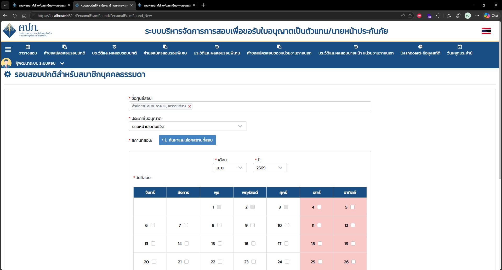
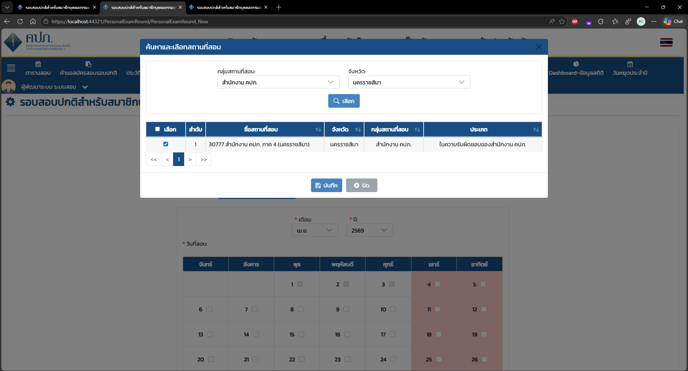
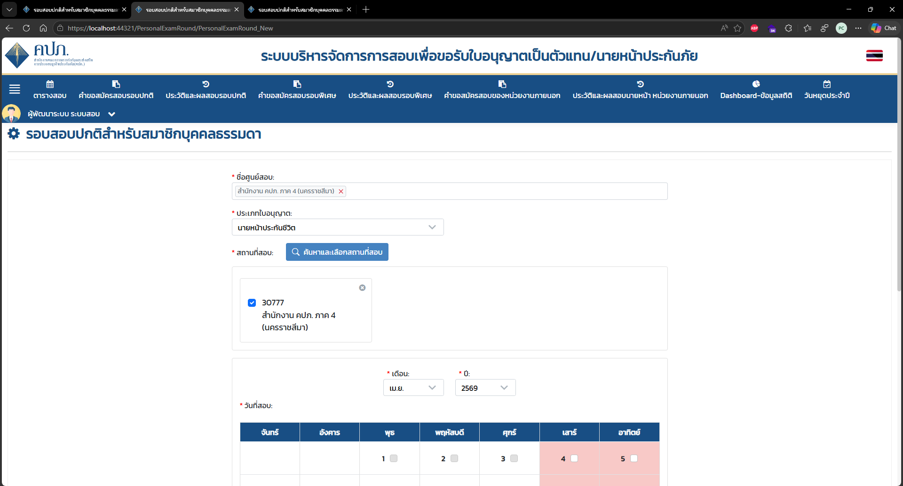
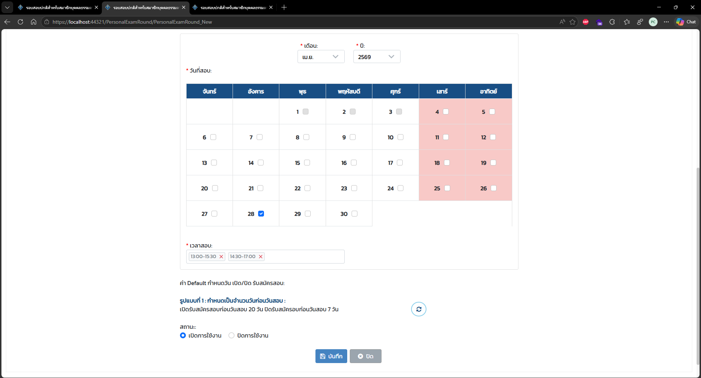

# OIC IIQE Registration Examination Spec

> การสอบการขึ้นทะเบียน นายหน้าประกันชีวิต/นายหน้าประกันวินาศภัย การประกันต่อ Life/Non Life Reinsurance Broker

---

## Context

- `D:\Works\OICIIQE\*`
- `D:\Works\OICIIQE\OIC_IIQE`
- `D:\Works\OICIIQE\IIQE_API`
- `D:\Works\OICIIQE\Brain_IIQE\registration_examination_spec\screenshort\*`

---

## Links

- [[IIQE 2025] ประกันภัยต่อ สรุป](https://docs.google.com/spreadsheets/d/11idsezbjxl3TPpq6DsTspX2MMYa8NEnIhEyejgE5UnU/)
- [[IIQE 2025] ประกันภัยต่อ](https://docs.google.com/spreadsheets/d/1a2PSQeYnBNX1KnhCa-XqZv8l_G1LiwVf5LqQssVFeVE/)

---

## Connection String

```json
"DefaultConnection": "DATA SOURCE=(DESCRIPTION=(ADDRESS_LIST=(ADDRESS=(PROTOCOL=TCP)(HOST=192.168.1.138)(PORT=1521)))(CONNECT_DATA=(SERVER=DEDICATED)(SERVICE_NAME=ORCLPDB)));User Id=oiciiqe;Password=oiciiqe;"
```

---

## Observation

ระบบรับสมัครสอบเพื่อขอรับใบอนุญาตเป็นนายหน้าประกันภัย  
การสอบรอบปกติบุคคลธรรมดา จะเป็นการเปิดรอบสอบโดยเจ้าหน้าที่ คปภ. และ สมัครสอบโดยประชาชน จะมี Flow ดังนี้

### เจ้าหน้าที่ คปภ. เปิดรอบสอบ (สร้างรอบสอบ)

1. เจ้าหน้าที่ คปภ. เข้าสู่ระบบเจ้าหน้าที่ (`/Login/LoginStaff`)

2. ไปที่หน้า **รอบสอบปกติสำหรับสมาชิกบุคคลธรรมดา** (`/PersonalExamRound/PersonalExamRound`) และกดปุ่ม **"+ เพิ่ม"** ระบบจะ redirect ไปยังหน้า (`/PersonalExamRound/PersonalExamRound_New`)

   

   > **[รูป 1]** หน้ารายการรอบสอบปกติสำหรับสมาชิกบุคคลธรรมดา (`/PersonalExamRound/PersonalExamRound`)
   > แสดง filter ค้นหา (ชื่อศูนย์สอบ, ชื่อสถานที่สอบ, ประเภทใบอนุญาต, ช่วงวันที่, เวลาสอบ, รหัสรอบสอบ, สถานะ)
   > และตารางรายการรอบสอบที่มีอยู่ โดยมีปุ่ม **"+ เพิ่ม"** สำหรับเพิ่มรอบสอบใหม่
   > คอลัมน์ในตาราง: ลำดับ, ชื่อสถานที่สอบ, วันที่สอบ, เวลาสอบ, ประเภทใบอนุญาต, รหัสรอบสอบ, ที่นั่งสอบทั้งหมด, ที่นั่งคงเหลือ, สถานะ, แก้ไขล่าสุดโดย, วันที่/เวลาแก้ไขล่าสุด

   

   > **[รูป 2]** หน้าฟอร์มสร้างรอบสอบใหม่ (`/PersonalExamRound/PersonalExamRound_New`)
   > แสดง field กรอกข้อมูล ได้แก่:
   > - **ชื่อศูนย์สอบ** (แบบ multi-select tag): ตัวอย่าง "สำนักงาน คปภ. ภาค 4 (นครราชสีมา)"
   > - **ประเภทใบอนุญาต** (dropdown): ตัวอย่าง "นายหน้าประกันชีวิต"
   > - **สถานที่สอบ**: ปุ่ม "ค้นหาและเลือกสถานที่สอบ"
   > - **วันที่สอบ**: ปฏิทิน แสดงเดือน/ปี (เม.ย. 2569) พร้อม checkbox เลือกวันที่ต้องการ (เสาร์-อาทิตย์ highlight สีชมพู)

3. กรอกข้อมูล ดังนี้

   - **ชื่อศูนย์สอบ** (สามารถระบุได้มากกว่า 1 ศูนย์สอบ)  
     > **Note:** ศูนย์สอบ คือ Table `MT_T_EXAM_CENTER`

   - **ประเภทใบอนุญาต**  
     ระบุตามที่ศูนย์สอบที่เลือกที่สามารถเปิดสอบตามประเภทใบอนุญาตนั้น ๆ ได้ เช่น นายหน้าประกันชีวิต, นายหน้าประกันวินาศภัย, อื่น ๆ แต่เลือกได้ 1 ประเภทใบอนุญาต  
     > **Note:** ประเภทใบอนุญาต คือ Table `MT_T_LICENSE_TYPE`
     - นายหน้าประกันชีวิต
     - นายหน้าประกันวินาศภัย

   - **สถานที่สอบ** กดปุ่ม **"ค้นหาและเลือกสถานที่สอบ"**

     

     > **[รูป 2 - ซ้ำ]** แสดงปุ่ม **"ค้นหาและเลือกสถานที่สอบ"** อยู่ในแถว field สถานที่สอบ บนหน้าฟอร์มสร้างรอบสอบ

     ระบบจะแสดง Modal **"ค้นหาและเลือกสถานที่สอบ"**

     

     > **[รูป 3]** Modal **"ค้นหาและเลือกสถานที่สอบ"** (ยังไม่ได้ค้นหา)
     > มี filter: **กลุ่มสถานที่สอบ** (dropdown: "-- กรุณาเลือก --") และ **จังหวัด** (dropdown: "ประจวบคีรีขันธ์")
     > ปุ่ม **"เลือก"** สำหรับค้นหา, ตารางแสดงผลมีคอลัมน์: เลือก, ลำดับ, ชื่อสถานที่สอบ, จังหวัด, กลุ่มสถานที่สอบ, ประเภท
     > สถานะ: "ไม่พบข้อมูล" (เพราะยังไม่ได้กดค้นหา)

     

     > **[รูป 4]** Modal **"ค้นหาและเลือกสถานที่สอบ"** (หลังค้นหาแล้ว)
     > filter: กลุ่มสถานที่สอบ = "สำนักงาน คปภ.", จังหวัด = "นครราชสีมา"
     > ผลการค้นหา: พบ 1 รายการ — ลำดับ 1: สถานที่สอบ "30777 สำนักงาน คปภ. ภาค 4 (นครราชสีมา)", จังหวัด: นครราชสีมา, กลุ่ม: สำนักงาน คปภ., ประเภท: ในความรับผิดชอบของสำนักงาน คปภ.
     > มี checkbox เลือก (ถูก tick แล้ว)

     > **Note:** สถานที่สอบ คือ Table `MT_T_EXAM_LOCATION`

     กดบันทึก เพื่อยืนยันสถานที่สอบ

     

     > **[รูป 5]** หน้าฟอร์มหลัง บันทึกสถานที่สอบสำเร็จ
     > field **สถานที่สอบ** แสดง card: checkbox tick + รหัส "30777" + ชื่อ "สำนักงาน คปภ. ภาค 4 (นครราชสีมา)" พร้อมปุ่ม ✕ สำหรับลบ
     > ด้านล่างยังแสดง section เลือกวันที่สอบ (ปฏิทิน เม.ย. 2569)

   - **ระบุวันที่สอบ และเวลาสอบ**

     

     > **[รูป 6]** Section กรอกวันที่และเวลาสอบ
     > - **วันที่สอบ**: ปฏิทิน เดือน เม.ย. ปี 2569 — เลือกวันที่ 28 (อังคาร) ไว้แล้ว (checkbox สีน้ำเงิน)
     > - **เวลาสอบ**: multi-tag เลือกได้หลายช่วง ตัวอย่าง "13:00-15:30" และ "14:30-17:00"
     > - **ค่า Default วันเปิด/ปิดรับสมัครสอบ**: รูปแบบที่ 1 — เปิดรับสมัครก่อนวันสอบ 20 วัน, ปิดรับสมัครก่อนวันสอบ 7 วัน (พร้อมปุ่ม reset)
     > - **สถานะ**: radio button (เปิดการใช้งาน / ปิดการใช้งาน)
     > - ปุ่ม **"บันทึก"** และ **"ปิด"**

   - กดยืนยันเพื่อบันทึกข้อมูลรอบสอบ

     

     > **[รูป 7]** Dialog ยืนยันการบันทึกสำเร็จ
     > แสดง icon วงกลมสีเขียว + เครื่องหมายถูก พร้อมข้อความ **"บันทึกข้อมูลเรียบร้อยแล้ว"** และปุ่ม **"ปิด"**
     > แสดงทับบน background ของหน้าฟอร์ม (เบลอ)

     > **Note:** รอบสอบ คือ Table `MT_T_P_EXAM_ROUND` และ Table `MT_T_P_EXAM_ROUND_DT`

### ประชาชน (บุคคลธรรมดา) สมัครสอบ

1. xxxxx
2. yyyyy

---

## Problems

จาก Observation

implement การประเภทการขึ้นทะเบียน `[OICIIQE.MT_T_REGISTRATION_TYPE]` เพิ่มเติม

| ประเภท | รหัส |
|--------|------|
| นายหน้าประกันชีวิต การประกันต่อ | Life Reinsurance Broker |
| นายหน้าประกันวินาศภัย การประกันต่อ | Non Life Reinsurance Broker |

---

## Task

1. วางแผนการ Implement ระบบ เพื่อให้รองรับการเปิดรอบสอบ (ใช้ Plan mode)
2. ตรวจสอบผลกระทบ
3. หากมี Script Database ที่จะต้องไป Execute ให้เตรียมให้ด้วย
