# OIC IIQE Registration Examination Spec

> การสอบการขึ้นทะเบียน นายหน้าประกันชีวิต/นายหน้าประกันวินาศภัย การประกันต่อ Life/Non Life Reinsurance Broker

---

## Context

- `D:\Works\OICIIQE\*`
- `D:\Works\OICIIQE\OIC_IIQE`
- `D:\Works\OICIIQE\IIQE_API`
- `D:\Works\OICIIQE\Brain_IIQE\registration_examination_spec\screenshort\*`

---

## Links

- [[IIQE 2025] ประกันภัยต่อ สรุป](https://docs.google.com/spreadsheets/d/11idsezbjxl3TPpq6DsTspX2MMYa8NEnIhEyejgE5UnU/)
- [[IIQE 2025] ประกันภัยต่อ](https://docs.google.com/spreadsheets/d/1a2PSQeYnBNX1KnhCa-XqZv8l_G1LiwVf5LqQssVFeVE/)

---

## Connection String

```json
"DefaultConnection": "DATA SOURCE=(DESCRIPTION=(ADDRESS_LIST=(ADDRESS=(PROTOCOL=TCP)(HOST=192.168.1.138)(PORT=1521)))(CONNECT_DATA=(SERVER=DEDICATED)(SERVICE_NAME=ORCLPDB)));User Id=oiciiqe;Password=oiciiqe;"
```

---

## Observation

ระบบรับสมัครสอบเพื่อขอรับใบอนุญาตเป็นนายหน้าประกันภัย  
การสอบรอบปกติบุคคลธรรมดา จะเป็นการเปิดรอบสอบโดยเจ้าหน้าที่ คปภ. และ สมัครสอบโดยประชาชน (บุคคลธรรมดา) จะมี Flow ดังนี้

> ตัวอย่างนี้จะเป็นใบอนุญาต **นายหน้าประกันชีวิต**

### 1. เจ้าหน้าที่ คปภ. เปิดรอบสอบ (สร้างรอบสอบ)

1. เจ้าหน้าที่ คปภ. เข้าสู่ระบบเจ้าหน้าที่ (`/Login/LoginStaff`)

2. ไปที่หน้า **รอบสอบปกติสำหรับสมาชิกบุคคลธรรมดา** (`/PersonalExamRound/PersonalExamRound`) และกดปุ่ม **"+ เพิ่ม"** ระบบจะ redirect ไปยังหน้า (`/PersonalExamRound/PersonalExamRound_New`)

   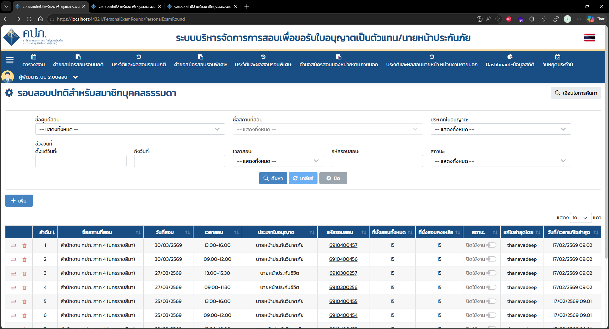

   > **[รูป 1]** หน้ารายการรอบสอบปกติสำหรับสมาชิกบุคคลธรรมดา (`/PersonalExamRound/PersonalExamRound`)
   > แสดง filter ค้นหา (ชื่อศูนย์สอบ, ชื่อสถานที่สอบ, ประเภทใบอนุญาต, ช่วงวันที่, เวลาสอบ, รหัสรอบสอบ, สถานะ)
   > และตารางรายการรอบสอบที่มีอยู่ โดยมีปุ่ม **"+ เพิ่ม"** สำหรับเพิ่มรอบสอบใหม่
   > คอลัมน์ในตาราง: ลำดับ, ชื่อสถานที่สอบ, วันที่สอบ, เวลาสอบ, ประเภทใบอนุญาต, รหัสรอบสอบ, ที่นั่งสอบทั้งหมด, ที่นั่งคงเหลือ, สถานะ, แก้ไขล่าสุดโดย, วันที่/เวลาแก้ไขล่าสุด

   

   > **[รูป 2]** หน้าฟอร์มสร้างรอบสอบใหม่ (`/PersonalExamRound/PersonalExamRound_New`)
   > แสดง field กรอกข้อมูล ได้แก่:
   > - **ชื่อศูนย์สอบ** (แบบ multi-select tag): ตัวอย่าง "สำนักงาน คปภ. ภาค 7 (นครปฐม)"
   > - **ประเภทใบอนุญาต** (dropdown): ตัวอย่าง "นายหน้าประกันชีวิต"
   > - **สถานที่สอบ**: ปุ่ม "ค้นหาและเลือกสถานที่สอบ"
   > - **วันที่สอบ**: ปฏิทิน แสดงเดือน/ปี (เม.ย. 2569) พร้อม checkbox เลือกวันที่ต้องการ (เสาร์-อาทิตย์ highlight สีชมพู)

3. กรอกข้อมูล ดังนี้

   - **ชื่อศูนย์สอบ** (สามารถระบุได้มากกว่า 1 ศูนย์สอบ)  
     > **Note:** ศูนย์สอบ คือ Table `MT_T_EXAM_CENTER`

   - **ประเภทใบอนุญาต**  
     ระบุตามที่ศูนย์สอบที่เลือกที่สามารถเปิดสอบตามประเภทใบอนุญาตนั้น ๆ ได้ เช่น นายหน้าประกันชีวิต, นายหน้าประกันวินาศภัย, อื่น ๆ แต่เลือกได้ 1 ประเภทใบอนุญาต  
     > **Note:** ประเภทใบอนุญาต คือ Table `MT_T_LICENSE_TYPE`
     - นายหน้าประกันชีวิต
     - นายหน้าประกันวินาศภัย

   - **สถานที่สอบ** กดปุ่ม **"ค้นหาและเลือกสถานที่สอบ"**

     

     > **[รูป 2 - ซ้ำ]** แสดงปุ่ม **"ค้นหาและเลือกสถานที่สอบ"** อยู่ในแถว field สถานที่สอบ บนหน้าฟอร์มสร้างรอบสอบ

     ระบบจะแสดง Modal **"ค้นหาและเลือกสถานที่สอบ"**

     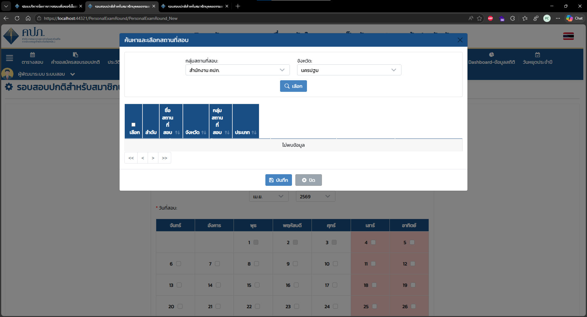

     > **[รูป 3]** Modal **"ค้นหาและเลือกสถานที่สอบ"** (ยังไม่ได้ค้นหา)
     > มี filter: **กลุ่มสถานที่สอบ** (dropdown: "-- กรุณาเลือก --") และ **จังหวัด** (dropdown: "นครปฐม")
     > ปุ่ม **"เลือก"** สำหรับค้นหา, ตารางแสดงผลมีคอลัมน์: เลือก, ลำดับ, ชื่อสถานที่สอบ, จังหวัด, กลุ่มสถานที่สอบ, ประเภท
     > สถานะ: "ไม่พบข้อมูล" (เพราะยังไม่ได้กดค้นหา)

     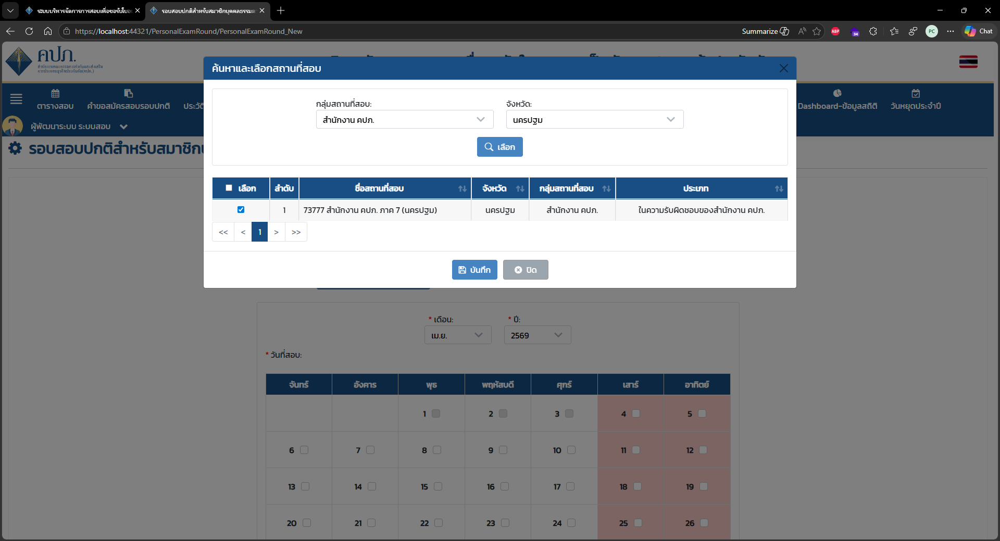

     > **[รูป 4]** Modal **"ค้นหาและเลือกสถานที่สอบ"** (หลังค้นหาแล้ว)
     > filter: กลุ่มสถานที่สอบ = "สำนักงาน คปภ.", จังหวัด = "นครปฐม"
     > ผลการค้นหา: พบ 1 รายการ — ลำดับ 1: สถานที่สอบ "73777 สำนักงาน คปภ. ภาค 7 (นครปฐม)", จังหวัด: นครปฐม, กลุ่ม: สำนักงาน คปภ., ประเภท: ในความรับผิดชอบของสำนักงาน คปภ.
     > มี checkbox เลือก (ถูก tick แล้ว)

     > **Note:** สถานที่สอบ คือ Table `MT_T_EXAM_LOCATION`

     กดบันทึก เพื่อยืนยันสถานที่สอบ

     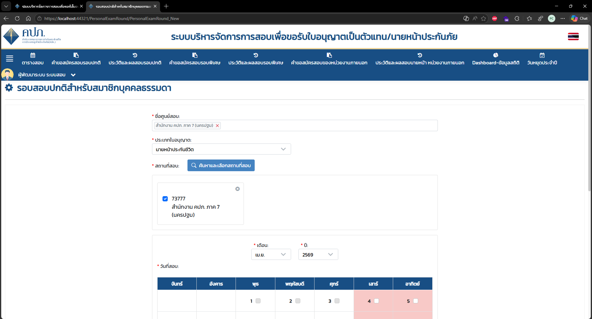

     > **[รูป 5]** หน้าฟอร์มหลัง บันทึกสถานที่สอบสำเร็จ
     > field **สถานที่สอบ** แสดง card: checkbox tick + รหัส "73777" + ชื่อ "สำนักงาน คปภ. ภาค 7 (นครปฐม)" พร้อมปุ่ม ✕ สำหรับลบ
     > ด้านล่างยังแสดง section เลือกวันที่สอบ (ปฏิทิน เม.ย. 2569)

   - **ระบุวันที่สอบ และเวลาสอบ**

     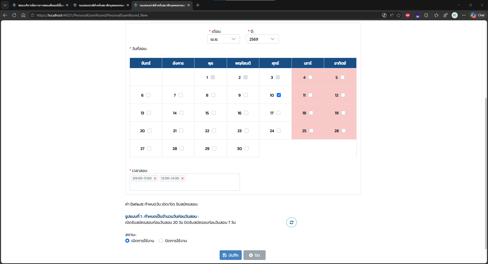

     > **[รูป 6]** Section กรอกวันที่และเวลาสอบ
     > - **วันที่สอบ**: ปฏิทิน เดือน เม.ย. ปี 2569 — เลือกวันที่ 17 (ศุกร์) ไว้แล้ว (checkbox สีน้ำเงิน)
     > - **เวลาสอบ**: multi-tag เลือกได้หลายช่วง ตัวอย่าง "09:00-11:00" และ "12:00-14:30"
     > - **ค่า Default วันเปิด/ปิดรับสมัครสอบ**: รูปแบบที่ 1 — เปิดรับสมัครก่อนวันสอบ 20 วัน, ปิดรับสมัครก่อนวันสอบ 7 วัน (พร้อมปุ่ม reset)
     > - **สถานะ**: radio button (เปิดการใช้งาน / ปิดการใช้งาน)
     > - ปุ่ม **"บันทึก"** และ **"ปิด"**

   - กดยืนยันเพื่อบันทึกข้อมูลรอบสอบ

     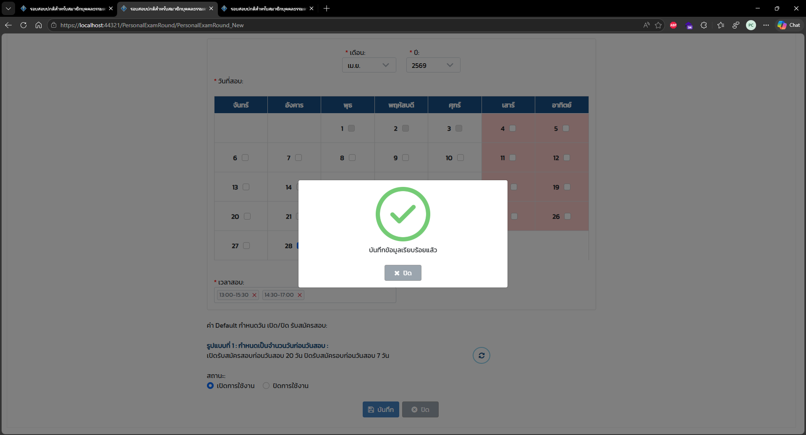

     > **[รูป 7]** Dialog ยืนยันการบันทึกสำเร็จ
     > แสดง icon วงกลมสีเขียว + เครื่องหมายถูก พร้อมข้อความ **"บันทึกข้อมูลเรียบร้อยแล้ว"** และปุ่ม **"ปิด"**
     > แสดงทับบน background ของหน้าฟอร์ม (เบลอ)

     > **Note:** รอบสอบ คือ Table `MT_T_P_EXAM_ROUND` และ Table `MT_T_P_EXAM_ROUND_DT`

3. ระบบแสดงรอบสอบที่สร้าง

   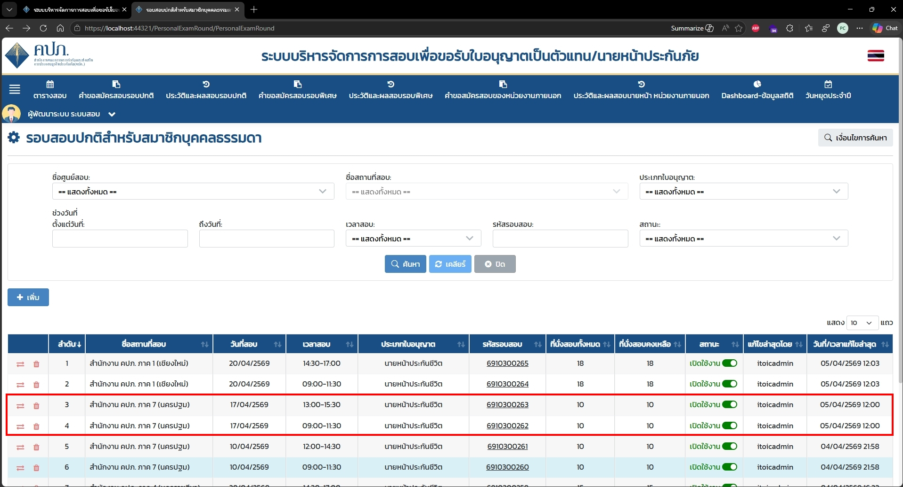

   > **[รูป 8_2]** หน้ารายการรอบสอบปกติ (`/PersonalExamRound/PersonalExamRound`) หลังสร้างรอบสอบสำเร็จ
   > แสดงรายการรอบสอบที่มีอยู่ในระบบ โดยรอบสอบที่เพิ่งสร้าง (ลำดับ 3 และ 4) จะถูก **highlight กรอบสีแดง** เพื่อเน้นให้เห็นชัด
   > ข้อมูลรอบสอบที่สร้างใหม่: สถานที่ "สำนักงาน คปภ. ภาค 7 (นครปฐม)", วันที่ 17/04/2569, ประเภท "นายหน้าประกันชีวิต"
   > รหัสรอบสอบ: 6910300263 (13:00-15:30) และ 6910300262 (09:00-11:30), ที่นั่ง 10 ที่, สถานะ "เปิดใช้งาน" (toggle สีเขียว)


### 2. ประชาชน (บุคคลธรรมดา) สมัครสอบ

1. ประชาชน (บุคคลธรรมดา) เข้าสู่ระบบสำหรับประชาชน (`/Login/Login`) ระบบจะ Redirect ไปหน้า Dashboard-หน้าหลัก (`/TaskBoards/Task`)

   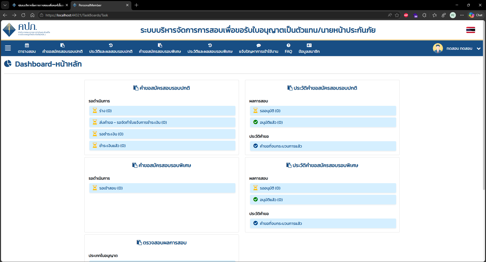

   > **[รูป 9]** หน้า **Dashboard-หน้าหลัก** (`/TaskBoards/Task`) สำหรับผู้ใช้งานประชาชน (บุคคลธรรมดา)
   > แสดง widget สรุปสถานะคำขอ แบ่งเป็น 4 กลุ่ม:
   > - **คำขอสมัครสอบรอบปกติ**: รอดำเนินการ (ร่าง, ส่งคำขอ-รอจัดทำใบแจ้งชำระเงิน, รอชำระเงิน, ชำระเงินแล้ว)
   > - **คำขอสมัครสอบรอบพิเศษ**: รอดำเนินการ (รอเข้าสอบ)
   > - **ประวัติคำขอสมัครสอบรอบปกติ**: ผลการสอบ (รออนุมัติ, อนุมัติแล้ว), ประวัติคำขอ (คำขอที่จบกระบวนการแล้ว)
   > - **ประวัติคำขอสมัครสอบรอบพิเศษ**: ผลการสอบ, ประวัติคำขอ
   > เมนูบาร์: ตารางสอบ, คำขอสมัครสอบรอบปกติ, ประวัติและผลสอบรอบปกติ, คำขอสมัครสอบรอบพิเศษ, ประวัติและผลสอบรอบพิเศษ, แจ้งปัญหาการเข้าใช้งาน, FAQ, ข้อมูลสมาชิก

   > **Note:** ข้อมูลผู้ใช้งาน/สมาชิก
   > - `MT_T_USER` — ข้อมูล Login (USERNAME, PASSWORD, ROLE_TYPE_ID, PERSONAL_MEMBER_ID)
   > - `MT_T_PERSONAL_MEMBER` — ข้อมูลสมาชิกบุคคลธรรมดา (FIRST_NAME_TH, LAST_NAME_TH, ID_CARD, EMAIL, MOBILE_PHONE, STATUS)
   > - `MT_T_ROLE_TYPE` — ประเภท Role และ DEFAULT_MENU_URL (ROLE_TYPE_ID = 1 = บุคคลธรรมดา)

2. กดปุ่ม **ตารางสอบ** ที่แถบเมนู เพื่อเข้าสู่หน้าตารางสอบ (`/ExamSchedule/ExamSchedule`)

   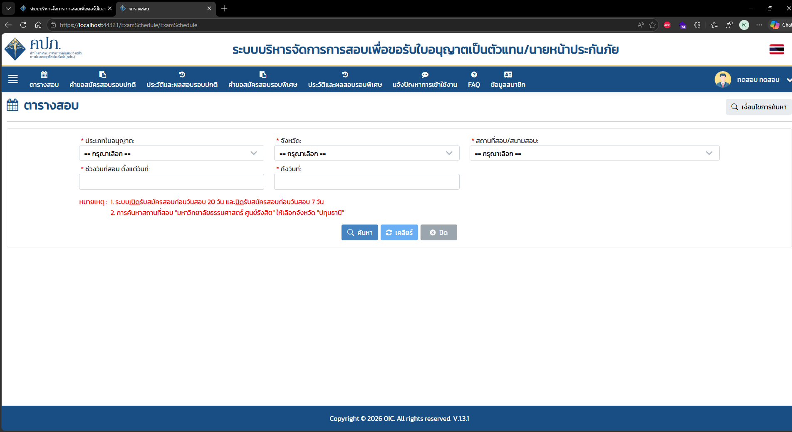

   > **[รูป 10]** หน้า **ตารางสอบ** (`/ExamSchedule/ExamSchedule`) ก่อนค้นหา
   > มี filter การค้นหา (ทุก field บังคับ): **ประเภทใบอนุญาต**, **จังหวัด**, **สถานที่สอบ/สนามสอบ**, **ช่วงวันที่สอบ ตั้งแต่วันที่**, **ถึงวันที่**
   > มีหมายเหตุสีแดง: 1. ระบบเปิดรับสมัครสอบก่อนวันสอบ 20 วัน และปิดรับสมัครก่อนวันสอบ 7 วัน / 2. การค้นหาสถานที่สอบ "มหาวิทยาลัยธรรมศาสตร์ ศูนย์รังสิต" ให้เลือกจังหวัด "ปทุมธานี"
   > ปุ่ม: **ค้นหา**, **เคลียร์**, **ปิด**

   > **Note:** ข้อมูลที่ใช้แสดงหน้าตารางสอบ
   > - `MT_T_P_EXAM_ROUND` — รอบสอบ (EXAM_DATE, EXAM_TIME_ID, EXAM_LOCATION_ID, LICENSE_TYPE_ID, ADMISSION_S_DATE, ADMISSION_E_DATE, C_ROUND_SETTING_MAX_AMOUNT, IS_ACTIVE)
   > - `MT_T_EXAM_TIME` — เวลาสอบ (TEST_TIME เช่น "09:00-11:30")
   > - `MT_T_EXAM_LOCATION` — สถานที่สอบ (NAME_TH, AG_CODE, CODE, PROVINCE_ID)
   > - `MT_T_LICENSE_TYPE` — ประเภทใบอนุญาต (CODE, DISPLAY_NAME_TH)
   > - `MT_T_PROVINCE` — จังหวัด (NAME_TH) ใช้ใน filter ค้นหา
   > - `IIQE_T_P_EXAM_ROUND_LIST` — นับจำนวนที่นั่งที่มีผู้สมัครแล้ว (COUNT โดย EXAM_SEAT_NUMBER IS NOT NULL)
   
3. ค้นหารอบสอบโดยระบุ Parameter

   - ประเภทใบอนุญาต: นายหน้าประกันชีวิต
   - จังหวัด: นครปฐม
   - สถานที่สอบ/สนามสอบ: สำนักงาน คปภ. ภาค 7 (นครปฐม)
   - ช่วงวันที่สอบ ตั้งแต่วันที่: 05/04/2569
   - ถึงวันที่: 30/04/2569

   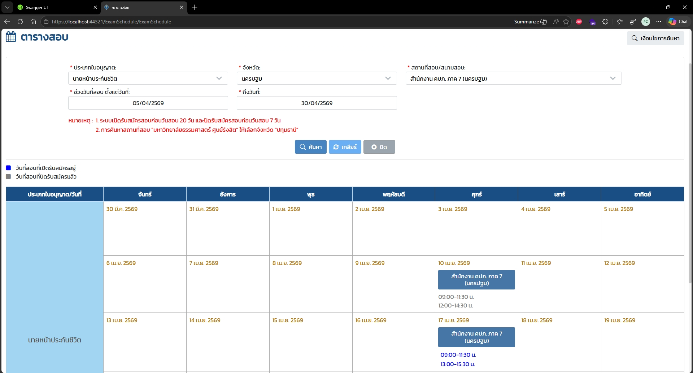

   > **[รูป 11_1]** หน้า **ตารางสอบ** หลังค้นหาด้วย filter ที่ระบุ
   > แสดงผลในรูปแบบ **ปฏิทิน** (calendar view) แบ่งตามคอลัมน์ วันจันทร์-อาทิตย์
   > Legend: สีน้ำเงิน = วันที่สอบที่เปิดรับสมัครอยู่, สีเทา = วันที่สอบที่ปิดรับสมัครแล้ว
   > รอบสอบที่แสดง (ประเภท "นายหน้าประกันชีวิต"):
   > - **10 เม.ย. 2569 (ศุกร์)**: สำนักงาน คปภ. ภาค 7 (นครปฐม) — 09:00-11:30 น., 12:00-14:30 น.
   > - **17 เม.ย. 2569 (ศุกร์)**: สำนักงาน คปภ. ภาค 7 (นครปฐม) — 09:00-11:30 น. (สีน้ำเงิน/เปิดรับสมัคร), 13:00-15:30 น.

4. กดเลือกเวลาสอบจากหน้าตารางสอบ เช่น เลือกเวลา **"09:00-11:30 น. ของวันที่ 17 เม.ย. 2569"** ระบบจะ redirect ไปยังหน้า **คำขอสมัครสอบรอบปกติสำหรับสมาชิกบุคคลธรรมดา** (`/ExamRequest/Detail/New/0/31797`) พร้อมระบุข้อมูลรอบสอบให้อัตโนมัติตามที่ผู้สมัครเลือก หากข้อมูลถูกต้อง ให้กดปุ่ม **"สร้างคำขอสมัครสอบ"**

   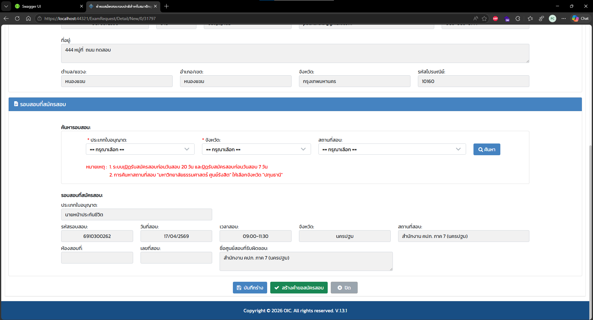

   > **[รูป 12]** หน้า **คำขอสมัครสอบรอบปกติสำหรับสมาชิกบุคคลธรรมดา** (`/ExamRequest/Detail/New/0/31797`)
   > ส่วนบน: ข้อมูลที่อยู่ของผู้สมัคร (ที่อยู่, ตำบล/แขวง, อำเภอ/เขต, จังหวัด, รหัสไปรษณีย์)
   > ส่วน **"รอบสอบที่สมัครสอบ"**: มีฟังก์ชันค้นหารอบสอบ (ประเภทใบอนุญาต, จังหวัด, สถานที่สอบ) และแสดงข้อมูลรอบสอบที่เลือก:
   > - ประเภทใบอนุญาต: นายหน้าประกันชีวิต
   > - รหัสรอบสอบ: 6910300262, วันที่สอบ: 17/04/2569, เวลาสอบ: 09:00-11:30
   > - จังหวัด: นครปฐม, สถานที่สอบ: สำนักงาน คปภ. ภาค 7 (นครปฐม)
   > - ชื่อศูนย์สอบที่รับผิดชอบ: สำนักงาน คปภ. ภาค 7 (นครปฐม)
   > ปุ่ม: **"บันทึกร่าง"**, **"สร้างคำขอสมัครสอบ"** (สีเขียว), **"ปิด"**

   - ระบบแสดง Popup ยืนยัน ถ้ากด **"ยืนยัน"** จะสร้างคำขอสมัครสอบ

   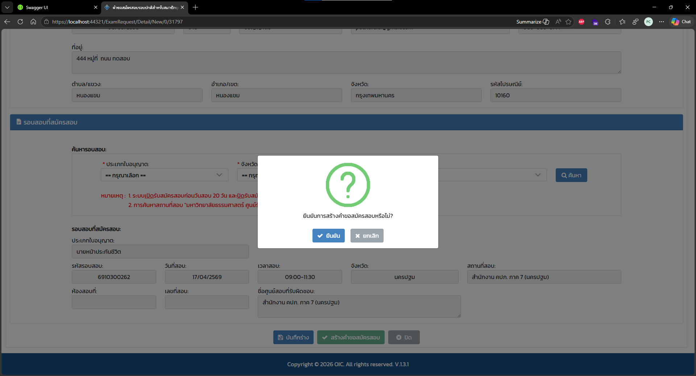

   > **[รูป 13]** Dialog ยืนยันการสร้างคำขอสมัครสอบ
   > แสดง icon วงกลมสีเขียว + เครื่องหมาย **?** พร้อมข้อความ **"ยืนยันการสร้างคำขอสมัครสอบหรือไม่?"**
   > ปุ่ม: **"ยืนยัน"** (สีน้ำเงิน) และ **"ยกเลิก"** (สีเทา)
   > แสดงทับบน background ของหน้าคำขอสมัครสอบ (เบลอ) ข้อมูลรอบสอบยังคงมองเห็นอยู่เบื้องหลัง

   > **Note:** การสร้างคำขอสมัครสอบจะ Insert/Update ลง Tables ดังนี้
   > - `IIQE_T_P_EXAM_REQ` — คำขอสมัครสอบหลัก (PERSONAL_MEMBER_ID, P_EXAM_ROUND_ID, EXAM_FEE, REQ_DATE, FLOW_STATUS_ID, RUNNING_NUMBER, RUNNING_YEAR, RUNNING_MONTH)
   > - `IIQE_T_P_EXAM_ROUND_LIST` — จองที่นั่งสอบ (P_EXAM_REQ_ID, P_EXAM_ROUND_ID, EXAM_SEAT_NUMBER, EXAM_LOCATION_ID)
   > - `IIQE_T_P_EXAM_REQ_FLOW` — ประวัติการเปลี่ยน Status คำขอ (P_EXAM_REQ_ID, FLOW_STATUS_ID)
   > - `MT_T_FLOWSTATUS` — ชื่อสถานะ (ID: 6 = ร่าง, 46 = ส่งคำขอ/รอจัดทำใบแจ้งชำระเงิน, 47 = รอชำระเงิน, 49 = ชำระเงินแล้ว)

5. ระบบ redirect ไปยังหน้า **ชำระเงินค่าสมัครสอบ**

   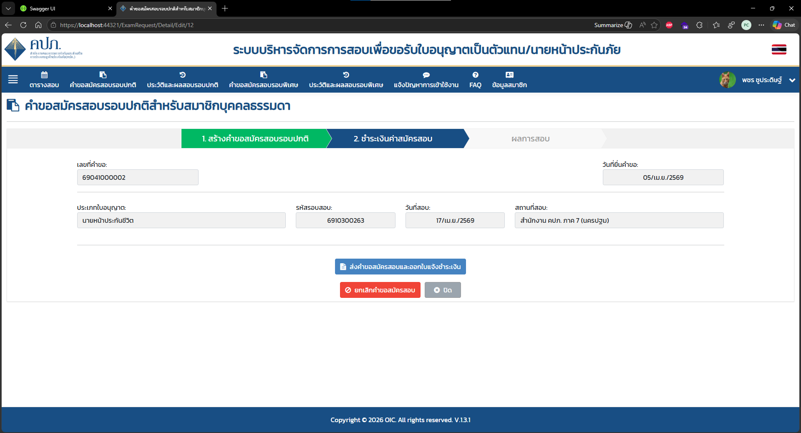

   > **[รูป 14]** หน้า **คำขอสมัครสอบรอบปกติสำหรับสมาชิกบุคคลธรรมดา** (`/ExamRequest/Detail/Edit/12`) หลังสร้างคำขอสำเร็จ
   > แสดง Stepper workflow 3 ขั้นตอน: **1. สร้างคำขอสมัครสอบรอบปกติ** (เขียว/เสร็จแล้ว) → **2. ชำระเงินค่าสมัครสอบ** (น้ำเงิน/ขั้นตอนปัจจุบัน) → ผลการสอบ
   > ข้อมูลที่แสดง:
   > - เลขที่คำขอ: 69041000002, วันที่ยื่นคำขอ: 05/เม.ย./2569
   > - ประเภทใบอนุญาต: นายหน้าประกันชีวิต
   > - รหัสรอบสอบ: 6910300263, วันที่สอบ: 17/เม.ย./2569
   > - สถานที่สอบ: สำนักงาน คปภ. ภาค 7 (นครปฐม)
   > ปุ่ม: **"ส่งคำขอสมัครสอบและออกใบแจ้งการชำระเงิน"** (สีน้ำเงิน), **"ยกเลิกคำขอสมัครสอบ"** (สีแดง), **"ปิด"**

   > **Note:** ข้อมูลที่แสดงในหน้านี้มาจาก `IIQE_T_P_EXAM_REQ` (JOIN กับ `MT_T_P_EXAM_ROUND`, `MT_T_EXAM_LOCATION`, `MT_T_LICENSE_TYPE`)
   > การตั้งค่าวันครบกำหนดชำระเงินมาจาก `MT_T_PAYMENT_DUEDATE` (NUMBER_OF_DAYS, TYPE, EXAM_TYPE)
   > ระบบตรวจสอบ Blocklist จาก `MT_T_EXAM_FRAUD_LIST` และ `LOG_T_BLOCKLIST_LOG` ก่อนอนุญาตให้ดำเนินการต่อ

6. ผู้สมัครกดปุ่ม ส่งคำขอสมัครสอบและออกใบแจ้งการชำระเงิน ระบบจะทำการส่งข้อมูลการสมัครสอบของผู้สมัคร ไปยังระบบออกใบแจ้งการชำระเงิน (ฺBillpayment) (ระบบ ERP เป็น Microsoft Dynamic 365) ผ่าน Web API เมื่อระบบ ERP สร้าง Bill Payment เรียบร้อยแล้ว จะส่งข้อมูลกลับมายังระบบ OICIIQE
ข้อมูลส่งไปสร้าง Billpayment จะมีดังนี้

   **ข้อมูลผู้สมัคร (Customer) — ส่งไปยัง `InImpCustomer`:**
   - รหัสสมาชิก (`CUST_ID`): `MEMBER_CODE`
   - ชื่อ-นามสกุล (`CUST_NAME`): ชื่อเต็มภาษาไทยของผู้สมัคร
   - เบอร์โทรศัพท์ (`TEL_ID`): `Mobile_Phone`
   - อีเมล (`EMAIL_ID`): อีเมลของสมาชิก
   - ที่อยู่ (`CUST_ADDR1`): ADDRESS + ตำบล/แขวง + อำเภอ/เขต + จังหวัด
   - รหัสไปรษณีย์ (`POST_ID`): POST_CODE (padding 5 หลัก)
   - ประเภทลูกค้า (`CUST_TYPE`): `"1"` (บุคคลธรรมดา)
   - กลุ่มลูกค้า (`GROUP_ID`): `"AR03"`

   **ข้อมูลใบแจ้งชำระเงิน (Bill Payment) — ส่งไปยัง `InImpMainRevenue`:**
   - เลขที่คำขอสมัครสอบ (`REFERENCE_NO`): `P_EXAM_REQ_CODE`
   - เลข Reference 1 (`REFERENCE_1`): คำนวณจาก Prefix + วันที่สอบ (ddMM) + ปี พ.ศ. (ตัวอย่าง: `0002512567`)
   - เลข Reference 2 (`REFERENCE_2`): คำนวณจาก Checksum ของ Ref1 + ยอดชำระ
   - ยอดค่าธรรมเนียมสอบ (`NET_AMT` / `TOT_AMT`): 200 บาท
   - วันครบกำหนดชำระ (`DUE_DT`): คำนวณจาก Bill Payment Setting
   - Biller ID (`BILLER_ID`): จาก Bill Payment Setting
   - รหัสบริษัท (`COMP_CODE`): `"OIC"`
   - รหัสสินค้า (`ITEMID`): จากฐานข้อมูล
   - ชื่อค่าธรรมเนียม (`DESCP_1`): `FEE_NAME`
   - รายละเอียดรอบสอบ (`DESCP_2`): `"วันที่สอบ dd/MMM/yyyy เวลาสอบ HH:mm สถานที่สอบ ..."`
   - วันที่ต้องชำระ (`DESCP_3`): `"* ผู้สมัครสอบต้องชำระเงินภายใน 20.00 น. ของวันที่ dd/MMM/yyyy"`
   - Cost Center (`FD02_CostCenter`): `"231000"`
   - Posting Profile: `"EXAM"`
   - Bill Flag (`BillFlag`): `"Y"`

   หลังจากนั้นระบบ IIQE จะรับ Response จาก ERP และบันทึกลง Table `IIQE_T_BILL_PAYMENT` โดยแสดงข้อมูลดังนี้

   | ข้อมูลที่แสดง | Field ใน `IIQE_T_BILL_PAYMENT` | Field จาก ERP Response |
   |---|---|---|
   | เลข Ref.1 | `REF_NO_1` | `Description[0].REFERENCE1` |
   | เลข Ref.2 | `REF_NO_2` | `Description[0].REFERENCE2` |
   | เลขที่ใบแจ้งชำระ | `REF_NO` | `Description[0].REFERENCENO` |
   | ยอดที่ต้องชำระ (200 บาท) | `AMOUNT` | ค่าที่ส่งไป (`NET_AMT`) ไม่ได้รับกลับจาก ERP |
   | วันที่ครบกำหนดชำระ | `DUE_DATE` | `Description[0].DUE_DT` |
   | QR Code สำหรับ Scan เพื่อชำระเงิน | `QR_CODE` | สร้างจาก `\|BILLER_ID + REF_NO_1 + REF_NO_2 + AMOUNT` |
   | PDF ใบแจ้งชำระเงิน | `DOWNLOAD_ATTACHMENT_ID` → `MT_T_DOWNLOAD_ATTACHMENT.KEY` | `Description[0].FILE_DB64` (base64 → upload → เก็บ key) |
   | Biller ID | `BILLER_ID` | จาก Bill Payment Setting |
   | Company Code | `COMPANY_CODE` | `"OIC"` |
   | สถานะ | `STATUS` | `1` = รอชำระเงิน |
   | ประเภทสมาชิก | `MEMBER_TYPE` | `1` = บุคคลธรรมดา |

   > **Note:** Log การติดต่อ ERP บันทึกไว้ที่ Table `IIQE_LOG_BILLPAYMENT` (field: `REF_1`, `REF_2`, `DATA_JSON_REQ`, `DATA_JSON_RES`, `STATUS`, `RESPONSE_MESSAGE`)
  
7. ผู้สมัครดำเนินการชำระเงินผ่านชื่อทางต่าง ๆ ที่กำหนด เมื่อธนาคารได้รับข้อมูลการชำระเงิน จะส่งข้อมูลการชำระเงิน ไปยังระบบ ERP แล้วระบบ ERP ประมวลผลการชำระเงิน แล้วส่งข้อมูลใบเสร็จ (Receipt) กลับมายังระบบ OICIIQE

   > **Note:** ข้อมูลการชำระเงินและใบเสร็จ
   > - `IIQE_T_PAYMENT_DETAIL` — รายการชำระเงินจากธนาคาร (P_EXAM_REQ_ID, BANK_CODE, PAYMENT_DATE, PAYMENT_TIME, REF_1, REF_2, AMOUNT, RECEIPT_NO)
   > - `IIQE_T_PAYMENT_HEADER` — Header ของ batch file ที่รับจากธนาคาร (FILE_NAME, SERVICE_CODE, EFFECTIVE_DATE, IMPORT_BY)
   > - `IIQE_T_RECEIPT` — ใบเสร็จจาก ERP (REF_NO_1, REF_NO_2, P_EXAM_REQ_ID, CODE, RECEIPT_DATE, TOTAL_AMOUNT, URL_PATH, ERP_RESULT)
   > - `IIQE_T_RECEIPT_QUEUE` — คิวประมวลผลใบเสร็จ (batch processing)
   >
   > **การเชื่อมโยงกับ `IIQE_T_BILL_PAYMENT` และ `MT_T_DOWNLOAD_ATTACHMENT`:**
   >
   > เมื่อ ERP ส่ง Receipt กลับมา ระบบจะดำเนินการ 3 ขั้นตอนตามลำดับ:
   >
   > **ขั้นที่ 1 — Insert ใบเสร็จ** บันทึกลง `IIQE_T_RECEIPT`
   > JOIN กับ `IIQE_T_BILL_PAYMENT` ผ่าน `P_EXAM_REQ_ID` เพื่อดึง `REF_CODE` (เลขที่คำขอ) มาแสดงในรายงาน
   >
   > **ขั้นที่ 2 — Upload PDF ใบเสร็จ** PDF (base64 จาก ERP) → upload ไปยัง File Server
   > บันทึก file key ลง `MT_T_DOWNLOAD_ATTACHMENT` (ID, MENU_ID = 3, KEY = file path)
   > แล้ว Update `IIQE_T_BILL_PAYMENT.DOWNLOAD_ATTACHMENT_ID` ให้ชี้ไปยัง record ใน `MT_T_DOWNLOAD_ATTACHMENT`
   >
   > **ขั้นที่ 3 — Update สถานะ** `IIQE_T_BILL_PAYMENT.STATUS = 3` (ชำระเงินแล้ว/มีใบเสร็จ) match จาก `P_EXAM_REQ_ID`
   >
   > **Relationship:**
   > ```
   > IIQE_T_RECEIPT.P_EXAM_REQ_ID
   >     └──→ IIQE_T_BILL_PAYMENT.P_EXAM_REQ_ID
   >               └──→ IIQE_T_BILL_PAYMENT.DOWNLOAD_ATTACHMENT_ID
   >                         └──→ MT_T_DOWNLOAD_ATTACHMENT.ID
   >                                   └── .KEY = file path ของ PDF ใบแจ้งชำระ/ใบเสร็จ
   > ```

8. กระบวนการสมัครสอบเสร็จสิ้น ผู้สมัครสอบมีสิทธิ์เข้าสอบตามข้อมูลที่สมัครสอบ (รอบสอบ, สถานที่สอบ, วันที่สอบ, เวลาสอบ)

   > **Note:** หลังชำระเงินสำเร็จ ระบบจะ Update `IIQE_T_P_EXAM_REQ.FLOW_STATUS_ID` และ Insert ประวัติการเปลี่ยนสถานะลง `IIQE_T_P_EXAM_REQ_FLOW`
   > ผู้สมัครจะมีข้อมูลที่นั่งสอบใน `IIQE_T_P_EXAM_ROUND_LIST.EXAM_SEAT_NUMBER`

---

## Problems

จาก Observation ต้องการ Implement ระบบเพิ่มเติม คือการสอบประเภท "การขึ้นทะเบียน" โดยมี Concept ดังนี้

1. การสอบขึ้นทะเบียน เป็นการสอบเพื่อขึ้นทะเบียน
2. นำมาใช้กับการสอบ คือ การประกันต่อ เบื้องต้น มีการขึ้นทะเบียน 2 ประเภท ดังนี้

|ลำดับ| ประเภท | Type |
|:---:|---|---|
| 1 | นายหน้าประกันชีวิต การประกันต่อ | Life Reinsurance Broker |
| 2 | นายหน้าประกันวินาศภัย การประกันต่อ | Non Life Reinsurance Broker |

3. Project Owner ให้ Concept ว่า ขั้นตอนการเปิดรอบสอบ การสมัครสอบ การชำระเงิน จะเหมือนกับการสอบรอบปกติบุคคลธรรมดา แต่การออกแบบระบบ อยากให้แยกกับการสอบใบอนุญาต คือ (Requirement)
   **ตารางประเภท**
   - ประเภทใบอนุญาต จะใช้ตาราง `MT_T_LICENSE_TYPE`
   - ประเภทการสอบขึ้นทะเบียน อยากให้เพิ่มตาราง `MT_T_REGISTRATION_TYPE` Column ให้คล้ายกับตาราง `MT_T_LICENSE_TYPE`

   **การเลือกใบอนุญาต ตอนที่สร้างรอบสอบ (`/PersonalExamRound_New`)**
   - ที่ ประเภทใบอนุญาต ให้ดึงข้อมูลจาก 2 ตาราง มาแสดงเลย คือ `MT_T_LICENSE_TYPE` และ `MT_T_REGISTRATION_TYPE`
   - เปลี่ยน lable จาก `การเลือกใบอนุญาต` เป็น `การเลือกใบอนุญาต/การขึ้นทะเบียน`

   **การตั้งค่าศูนย์สอบ  (`/ExamCenter/ExamCenter_Detail/50`)**
   - ที่ ประเภทใบอนุญาตที่รับผิดชอบ ให้ดึงข้อมูลจาก 2 ตาราง มาแสดงเลย คือ `MT_T_LICENSE_TYPE` และ `MT_T_REGISTRATION_TYPE`

---

## Task

1. วางแผนการ Implement ระบบ เพื่อให้รองรับการเปิดรอบสอบ (ใช้ Plan mode)
2. ตรวจสอบผลกระทบ
3. หากมี Script Database ที่จะต้องไป Execute ให้เตรียมให้ด้วย
